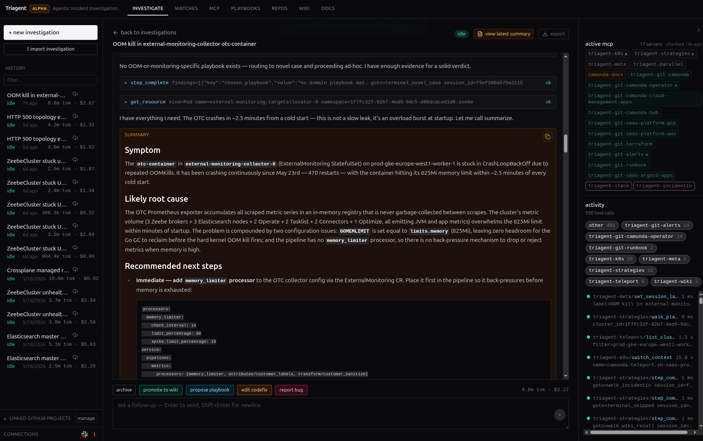
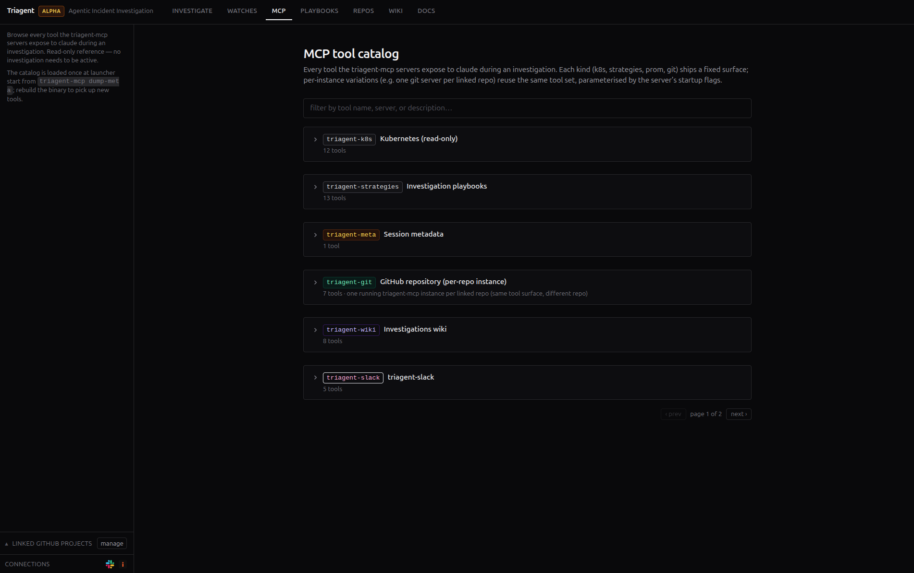
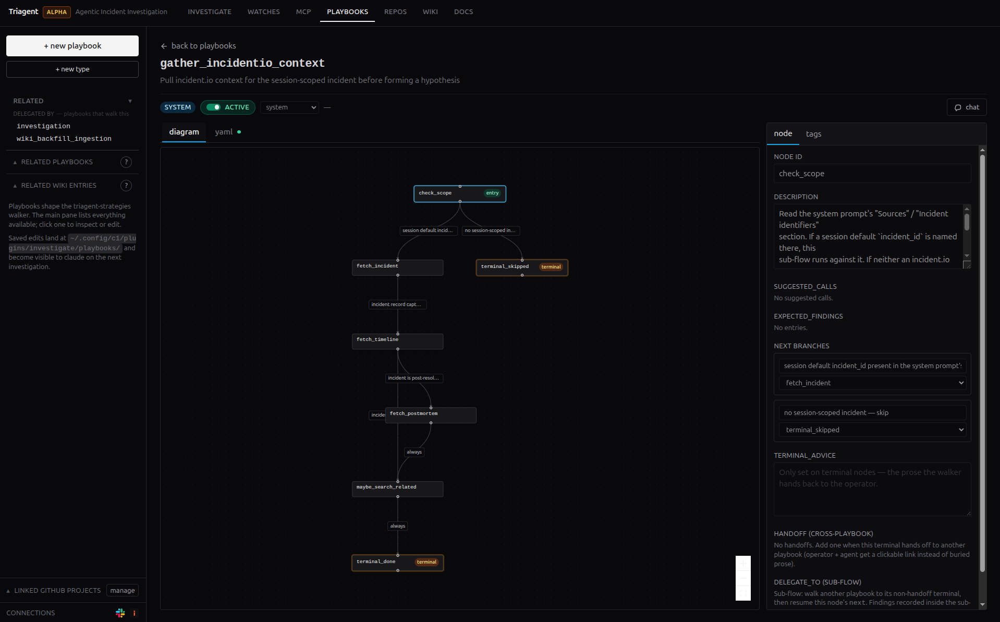
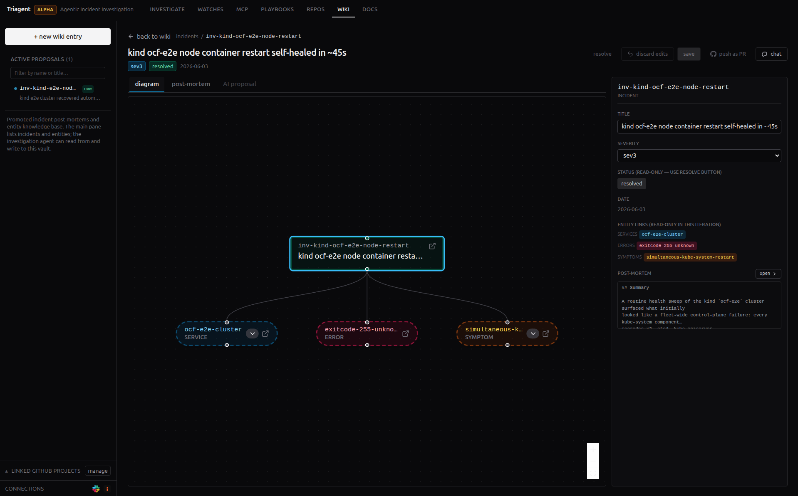
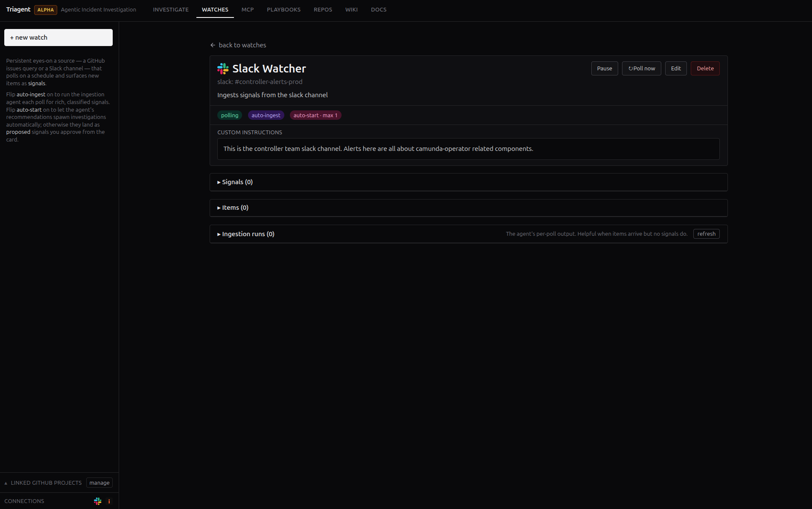

# Triagent

> An AI teammate for cloud incident triage, driven from your browser.

Triagent is a web app you run on your own machine. You hand it a symptom, and an AI assistant (powered by [Claude](https://claude.com/claude-code)) investigates it the way you would, working across your infrastructure to check the surfaces where the answer usually hides. When it's done, it hands back a written diagnosis you can paste straight into a ticket.

It connects to the places you already look: Kubernetes, AWS, and GCP (all read-only), Prometheus, Slack, GitHub, and incident.io, plus anything else you wire up via [MCP](https://modelcontextprotocol.io) (the open standard for plugging AI assistants into tools).

Every step it takes is shown live, so you can follow its reasoning, check its work, or interrupt it at any point. Its access to your clusters and cloud accounts is read-only; the only changes it makes beyond your own machine are Git pull requests you review before merging (a new playbook, a wiki entry, a saved investigation). You run it on your own machine, and teams share those playbooks, wiki, and investigations through Git, so whoever's on call next picks up where you left off instead of at the original alert.

**📚 [Read the full documentation →](https://sourcehawk.github.io/triagent/)**



## What it does

Cloud incident triage isn't a single command. It's a multi-tab scramble across half a dozen tools: dashboards, logs, the cloud console, Slack, the incident tracker, the runbook nobody can find. Triagent collapses that scramble into one conversation with one trail you can read back later:

- **It follows your procedures instead of guessing.** The troubleshooting know-how lives in **playbooks**: step-by-step procedures written as YAML that the assistant loads when it runs, not baked into the AI model itself. Teaching it to diagnose something new is a text edit, not a code change or an expensive model retrain.
- **It can only use the tools you give it.** The assistant doesn't get a shell or free rein on your infrastructure. Every action it can take is one specific, pre-defined tool with a known input. You decide exactly what it's allowed to do, and that list of tools doubles as documentation.
- **Every investigation makes the next one faster.** When it's done, the assistant can save what it learned: a new playbook (a procedure) or a **wiki** entry (a fact about your systems). Next time, recalling that is a single lookup instead of an archaeology dig through old Slack threads.

It can also watch for trouble on its own. Point it at Slack channels or GitHub issue queries (more sources on the way), and it triages new items as they land and proposes investigations without being asked. Turn on **auto mode** and it runs the routine ones start to finish before you've even read the page. You can take over at any moment.

## What's in the box

Four surfaces, each documented in depth on the [docs site](https://sourcehawk.github.io/triagent/):

- **[Investigations](https://sourcehawk.github.io/triagent/investigations/)**: the live triage view. Hand the assistant a symptom and some context (cluster, Slack thread, incident.io link, notes), watch it work through the diagnosis step by step, and ship the summary as markdown.
- **[Playbooks](https://sourcehawk.github.io/triagent/playbooks/)**: the step-by-step troubleshooting procedures the assistant follows, defined as YAML. Write and edit them right in the browser, with an AI assistant helping.
- **[Wiki](https://sourcehawk.github.io/triagent/wiki/)**: the team's lasting knowledge base of failure patterns and prior fixes, which the assistant can search.
- **[Watches](https://sourcehawk.github.io/triagent/watches/)**: rules that turn Slack messages, GitHub issues, or alerts into proposed investigations on their own.

<table>
<tr>
<td width="50%" valign="top">



**The assistant works from a fixed list of tools, not a shell.** Every action it can take is one specific, pre-defined tool. The same catalog the assistant works from is the one you edit.

</td>
<td width="50%" valign="top">



**Playbooks are just data.** Troubleshooting procedures written as YAML, edited in the browser with an AI assistant helping, and shipped as pull requests to your playbooks repo.

</td>
</tr>
<tr>
<td width="50%" valign="top">



**A wiki that compounds.** Every finished investigation can leave behind an entry, so tomorrow's recall is a single lookup instead of an archaeology dig through old Slack threads.

</td>
<td width="50%" valign="top">



**Watches close the loop.** Slack channels and GitHub queries become triaged signals. Routine ones kick off an investigation on their own, before the pager fires.

</td>
</tr>
</table>

## Quick start

### Requirements

The only thing triagent needs to launch is the Claude Code CLI. What it can reach during an investigation is set by your [profile](#customising-the-profile); the default profile is wired for Kubernetes, so the rest of these requirements cover that path. Cloud providers, Prometheus, Slack, GitHub, and incident.io attach through the profile too.

- The [Claude Code](https://claude.com/claude-code) CLI (`claude`) on your `$PATH` and signed in. Triagent drives Claude Code to do the reasoning, so what it reads during an investigation (logs, resource state, the surfaces it checks) is sent to Claude. Claude Code is a separate Anthropic product with its own account and pricing; its docs cover sign-in and which model it uses.
- A working kubeconfig with read access to the namespace you want to triage. Triagent talks to the cluster directly, so `kubectl` doesn't need to be installed.
- `tsh` if you use [Teleport](https://goteleport.com)-backed cluster discovery (optional).
- Kubernetes permissions to read pods/logs in the namespaces you investigate. Triagent does **not** create RBAC; its cluster tools are read-only and surface a permission error if your access falls short.

### Install

**macOS / Linux:**

```sh
curl -fsSL https://sourcehawk.github.io/triagent/install.sh | sh
```

**Windows (PowerShell):**

```powershell
irm https://sourcehawk.github.io/triagent/install.ps1 | iex
```

**Homebrew (macOS):**

```sh
brew install --cask sourcehawk/tap/triagent
```

**Manual download:** grab the archive for your OS/arch from [the latest release](https://github.com/sourcehawk/triagent/releases/latest) and put `triagent` + `triagent-mcp` somewhere on your `$PATH`.

The install script downloads both `triagent` (the launcher) and `triagent-mcp` (the MCP multiplexer) to `~/.local/bin` (or `%LOCALAPPDATA%\Programs\triagent` on Windows); make sure that directory is on your `$PATH`. The launcher locates `triagent-mcp` adjacent to itself or anywhere on `$PATH`. The Next.js frontend is embedded in the launcher, so the runtime ships as a single executable per binary.

**Build from source** (requires Node 20+ and Go; see `.tool-versions`):

```sh
make build
```

### Run

```sh
triagent start
```

This boots a localhost HTTP server, prints its URL with a per-launch token, and opens your browser to it. Press `Ctrl-C` to stop. It works out of the box on the embedded `default` profile; see [Customising the profile](#customising-the-profile) below to teach the assistant your stack and wire upstream repos.

In the browser:

1. **Pick a cluster** from the dropdown (sourced from your kubeconfig by default; Teleport if your profile uses it).
2. **Log in** if prompted (SSO/2FA prompts go to the launcher terminal).
3. **Add context** (all optional): a sentence on the symptom, a Slack channel, or an incident URL. The assistant narrows down the namespace itself.
4. **Investigate**: the assistant works through the playbook, uses its tools, and writes a summary you can copy or push upstream as a PR (once you've wired an upstream repo; see below).

### A few useful commands

```sh
triagent help                              # full command and flag reference
triagent start                             # boot the launcher
triagent start --profile /path/to/profile  # boot with a custom profile
```

### Customising the profile

A profile is the deployment-specific config that fits triagent to your platform: which playbooks the assistant follows, which tool integrations attach, what the new-investigation form asks for, and what the assistant already knows about your stack before it starts. The embedded `default` runs as-is but is platform-neutral. **Customising the profile is the highest-leverage step in a triagent setup.** Two overrides matter most:

- **`architecture.md`**: the briefing the assistant reads before every triage. Teach it your platform's CRDs, namespace conventions, dependency direction, and recurring failure modes. Every investigation starts informed instead of rediscovering your stack.
- **Upstream repos** (`defaults.playbooks_repo`, `defaults.wiki_repo`, `defaults.sessions_repo`): the GitHub repos backing the playbook set, team wiki, and committed session transcripts. Wiring these enables sync-from-upstream and push-as-PR; without them, edits stay local-only. Each repo is independent; wire any subset.

The recommended setup is a tiny overlay that inherits from `default` and only spells out what you're overriding:

```sh
mkdir -p ~/.config/triagent/profile
cat > ~/.config/triagent/profile/profile.yaml <<'YAML'
name: my-team
base: default

defaults:
  playbooks_repo: my-org/triagent-playbooks   # GitHub OWNER/REPO
  wiki_repo:      my-org/triagent-wiki
  sessions_repo:  my-org/triagent-sessions

prompt_files:
  architecture.md: architecture.md
YAML

$EDITOR ~/.config/triagent/profile/architecture.md     # describe your platform
triagent start --profile ~/.config/triagent/profile
```

Everything you leave out (paths, other prompts, investigation inputs, `kinds.json`, extra MCPs, Prometheus, model selection, auth) is inherited from `default`. See [Profiles](https://sourcehawk.github.io/triagent/profiles/) for the full schema, alternative layouts (full fork via `triagent create-profile`, air-gapped mode), and the longer narrative on each block.

## Contributing

PRs welcome. See [DEVELOPER_GUIDE.md](DEVELOPER_GUIDE.md) for the full contributor setup, [CLAUDE.md](CLAUDE.md) for the durable conventions, and [open issues](https://github.com/sourcehawk/triagent/issues) for ideas worth picking up.

CI gates the tests, the linter, and the frontend typecheck, so run all three before opening a PR:

```sh
make test                          # Go race tests + frontend vitest
make lint                          # Go lint
cd frontend && npm run typecheck   # frontend types
```

`make build` rebuilds the embedded frontend bundle and both binaries. For the UI dev loop (no Go rebuild for frontend changes):

```sh
go run ./cmd/triagent start          # terminal 1
cd frontend && npm run dev           # terminal 2, proxies /api/* to :8080
```

## License

[Apache 2.0](LICENSE)
