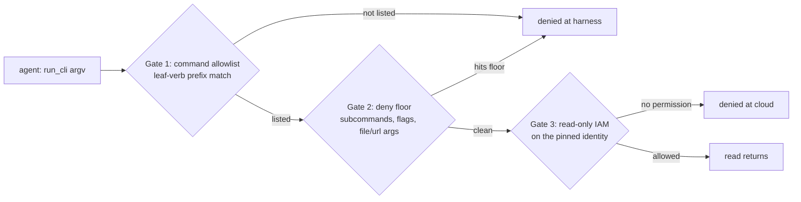

# Cloud providers

Triagent optionally gives the agent read-only context from the cloud the cluster sits on, GCP or AWS, so a Kubernetes investigation can follow a thread down into the cloud layer without a human leaving the loop. It is opt-in and configured entirely in the deployment profile: the core investigation flow (Kubernetes triage, playbooks, wiki) works without it.

Enable it when your clusters run on GKE or EKS and incidents routinely reach into cloud networking, IAM, logs, or the change-audit trail. Skip it when triage stays inside the cluster.

## What the cloud-context MCP gives the agent

A managed-Kubernetes incident is often only explicable from cloud context. A Pod cannot reach a dependency because of a firewall rule or a security group. A workload is denied because an identity lost a binding. The GKE or EKS cluster behaves unexpectedly because of how its networking or workload identity is configured. The smoking gun is in cloud logs, and "what changed right before this broke?" lives in the cloud audit trail, not in the cluster.

When a cloud source is configured, the launcher registers a `triagent-cloud-<alias>` MCP server for each investigation session. The agent reads cloud context along six axes:

| Axis | What it reads | GCP example | AWS example |
| --- | --- | --- | --- |
| inventory | projects/accounts and resources in view | `compute instances list` | `ec2 describe-instances` |
| reachability | VPCs, subnets, firewall rules, security groups, routes | `compute firewall-rules list` | `ec2 describe-security-groups` |
| permissions | IAM policies, roles, service accounts | `projects get-iam-policy` | `iam list-roles` |
| cluster | GKE/EKS networking and node config | `container clusters describe` | `eks describe-cluster` |
| logs | cloud logs | `logging read` | `logs filter-log-events` |
| audit | change history ("what changed before this broke") | `logging read … activity` | `cloudtrail lookup-events` |

In practice, chasing a Pod that cannot reach its database, the agent calls `list_inventory` to see the configured projects or accounts, `set_active_target` to pin the right one, then `run_cli` with `ec2 describe-security-groups` (or `compute firewall-rules list`) to find a rule blocking the path and `cloudtrail lookup-events` (or `logging read … activity`) to see which change introduced it and when. Every call is read-only.

The MCP is read-only by construction, not by convention. The agent supplies argument tokens to a fixed `gcloud` or `aws` binary that runs without a shell, against a positive command allowlist with a hardcoded deny floor underneath, as a pinned read-only identity it can neither select nor escalate. Three independent layers each have to hold for a read to go through, and none of them can be widened by the agent:



Gates 1 and 2 are enforced by the harness before the binary runs; Gate 3 is enforced by the cloud itself. A misconfigured-too-broad allowlist still cannot read secrets or write, because Gate 3 is the identity's own permissions.

Stated as a capability boundary, what an adversarial or compromised agent cannot do, and what stops each:

| The agent cannot… | Stopped by | Hard or soft |
| --- | --- | --- |
| write or mutate anything | Gate 3: read-only IAM on the pinned identity | hard |
| read secret values, object contents, or decrypted material | Gate 2 deny floor, backed by Gate 3 IAM | hard |
| exfiltrate via local files or URLs (`file://`, `@`, `http://`) | Gate 2 deny floor on argument values | hard |
| select, escalate, or authenticate a different identity | pin lives in environment; `--impersonate-service-account` / `--profile` deny-floored | hard |
| pivot to an unconfigured project or account | target-selecting flags deny-floored; reachable set bounded by the identity's IAM | hard |
| leave the allowed regions | `scope.regions` checked on argv | soft |

The first five hold even under a careless allowlist override, because they rest on the identity's own permissions and the hardcoded floor, neither of which the config can widen. Region scope is the one soft control: it rejects an explicit out-of-region `--region`/`--zone` but does not police an omitted one, so treat it as a guardrail against pivots, not a boundary (see [Scope allowlist](#scope-allowlist)).

## The pinned identity

The cloud identity is a deployment-chosen, read-only principal pinned in the profile. The agent can read which identity is active (it has a `session_status` whoami tool) and, when the deployment configures more than one target, switch among that pinned set with `set_active_target` (see [Active target](#active-target-moving-across-projects-and-accounts)) — but it has no tool to name an arbitrary identity, escalate one, or authenticate one. The deployment grants each pinned identity read-only IAM, and that grant is the outermost floor: even a misconfigured-too-broad command allowlist cannot read secrets or exfiltrate, because the identity itself lacks the permission.

The operator authenticates as themselves through their own normal cloud tooling. The harness then pins impersonation (GCP) or assume-role (AWS) of the configured read-only identity through environment it controls, never through anything the agent can supply. Triagent stores no cloud credential. Re-authentication is the operator's own corporate flow, outside Triagent.

## Before you start

You need:

- The provider CLI on the launcher host: `gcloud` for a GCP source, `aws` (v2) for an AWS source. Triagent shells these directly.
- A read-only identity to pin, created by whoever administers the cloud: a service account (GCP) or one IAM role per account (AWS). This is a one-time admin step.
- Permission for the operator to assume that identity: `roles/iam.serviceAccountTokenCreator` on the service account (GCP), or a role trust policy naming the operator's principal (AWS).

Setup has the same shape for both clouds:

1. Authenticate as yourself (`gcloud auth login` / `aws sso login`).
2. Create the read-only identity and grant it the read-only roles (per provider, below).
3. Add a `cloud:` entry to the deployment profile pinning that identity.
4. Restart the launcher, then open the connections panel: the source shows valid once its identity probe succeeds.

The `cloud:` block lives in the deployment profile (`profile.yaml`); see [Profiles](/docs/profiles) for where that file is and how it is structured. The launcher reads the profile once at startup, so restart it after editing.

## GCP setup

The operator authenticates normally:

```sh
gcloud auth login
```

The deployment grants the operator `roles/iam.serviceAccountTokenCreator` on a read-only service account. This is a one-time admin step, and the price of not storing a secret: the operator's own login plus the impersonated service account gives a clean audit trail (human plus role).

That binding lets the operator *act as* the service account; it is separate from what the service account itself may *read*. Create the account, grant yourself impersonation on it, then grant it read-only access on each project in the source's scope.

The account lives in a host project: the one encoded in its email, `…@<host-project>.iam.gserviceaccount.com`. The host project owns the account resource and is not necessarily a project the agent reads. The projects the agent reads are the ones you bind roles on, which can be the host project, a different set, or both.

```sh
# Create the read-only service account once, in a host project of your choice.
# Here the host project is `prod`, giving triage-readonly@prod.iam.gserviceaccount.com.
gcloud iam service-accounts create triage-readonly \
  --project=prod \
  --display-name="Triagent read-only cloud context"

SA=triage-readonly@prod.iam.gserviceaccount.com
OPERATOR=you@example.com   # the human who runs Triagent

# Let the operator impersonate the account. This binding is ON THE SERVICE
# ACCOUNT resource (note: `iam service-accounts add-iam-policy-binding`, not
# `projects ...`), and is what `gcloud auth login` plus the pin below exercise.
# Without it, impersonation fails with PERMISSION_DENIED on
# iam.serviceAccounts.getAccessToken. Needs serviceAccountAdmin/owner to run.
gcloud iam service-accounts add-iam-policy-binding "$SA" \
  --member="user:$OPERATOR" \
  --role="roles/iam.serviceAccountTokenCreator"

# Grant the minimal read-only roles covering the default tool surface
# (inventory, reachability, IAM read, GKE, logs, audit) on EACH project in the
# source's scope. These bindings are ON EACH PROJECT (`projects ...`), not on
# the service account, and the target projects are independent of the host
# project above.
for project in prod-platform prod-data; do
  for role in \
    roles/browser \
    roles/compute.viewer \
    roles/container.viewer \
    roles/iam.securityReviewer \
    roles/logging.viewer \
    roles/monitoring.viewer; do
    gcloud projects add-iam-policy-binding "$project" \
      --member="serviceAccount:$SA" --role="$role"
  done
done

# Verify the operator can impersonate the account: prints a token, not an error.
gcloud auth print-access-token --impersonate-service-account="$SA"
```

`roles/browser` lists and reads projects, `compute.viewer` and `container.viewer` cover networking and GKE, `iam.securityReviewer` reads IAM policies and service accounts, and the logging and monitoring viewers cover the logs and audit axes. If you would rather not curate, the single basic role `roles/viewer` is read-only across all of these and is the simpler, broader alternative. Role names are current as of writing; verify against GCP's IAM reference, which evolves.

The profile pins that service account as `assumed_identity` and lists the projects the agent may select among as `projects`:

```yaml
cloud:
  - alias: prod-gcp
    provider: gcp
    assumed_identity: triage-readonly@prod.iam.gserviceaccount.com    # the impersonated read-only SA
    projects:
      - {id: prod-platform}
      - {id: prod-data}
```

The harness sets `CLOUDSDK_AUTH_IMPERSONATE_SERVICE_ACCOUNT=<assumed_identity>` on the cloud MCP subprocess, so every `gcloud` call runs as the pinned service account while authenticating from the operator's base credentials. The agent never picks the identity, and because the pin lives in environment rather than in argv, `--impersonate-service-account` stays on the agent's deny floor without contradiction.

The whoami probe reports the source valid when impersonation is pinned to the configured service account and a minimal impersonated token read succeeds, proving the pin took effect. Under impersonation the operator's own base account stays active, so the probe does not require the active `gcloud` account to equal the service account; it confirms the pin and the read instead.

## AWS setup

The operator authenticates normally, for example:

```sh
aws sso login
```

An AWS role lives in exactly one account, so a source names a list of `accounts` — one `{account_id, role_arn}` per account the agent may reach — plus the operator's SSO base as `source_profile`. A single-account source is simply a one-entry list; there is no separate single-account shape. You do not pre-create an assume-role profile per account: triagent generates one read-only assume-role profile per entry at session start, layering each account's `role_arn` over `source_profile`. It writes these into its own per-profile config, never your `~/.aws/config` (see below).

```yaml
cloud:
  - alias: prod-aws
    provider: aws
    source_profile: default                                           # the operator's SSO base
    accounts:
      - {account_id: "123456789012", role_arn: "arn:aws:iam::123456789012:role/triage-readonly"}
```

An AWS source has no `assumed_identity` — its identity is per-account, in each `accounts` entry's `role_arn`. The harness sets `AWS_PROFILE` to the active account's generated profile on each `run_cli`, so the AWS CLI assumes that account's read-only role from the operator's base credentials. The pin lives in environment, so `--profile` stays on the agent's deny floor. The connections panel validates the default (first) account's role.

Each account's read-only role needs a permission policy and a trust policy. The minimal permission policy, scoped to exactly the default tool surface:

```json
{
  "Version": "2012-10-17",
  "Statement": [
    {
      "Sid": "TriageReadOnly",
      "Effect": "Allow",
      "Action": [
        "sts:GetCallerIdentity",
        "organizations:ListAccounts",
        "organizations:DescribeOrganization",
        "ec2:Describe*",
        "iam:GetRole", "iam:ListRoles",
        "iam:ListAttachedRolePolicies", "iam:ListRolePolicies", "iam:GetRolePolicy",
        "iam:GetPolicy", "iam:GetPolicyVersion", "iam:ListPolicies",
        "iam:SimulatePrincipalPolicy",
        "eks:ListClusters", "eks:DescribeCluster",
        "eks:ListNodegroups", "eks:DescribeNodegroup",
        "eks:ListFargateProfiles", "eks:DescribeFargateProfile",
        "logs:DescribeLogGroups", "logs:DescribeLogStreams",
        "logs:FilterLogEvents", "logs:GetLogEvents",
        "cloudtrail:LookupEvents", "cloudtrail:DescribeTrails", "cloudtrail:GetTrailStatus"
      ],
      "Resource": "*"
    }
  ]
}
```

The trust policy names the principal allowed to assume the role. That principal is whatever your `source_profile` authenticates as. In this single-account example the operator's SSO identity and the role both live in `123456789012`, so the account's own root works:

```json
{
  "Version": "2012-10-17",
  "Statement": [
    {
      "Effect": "Allow",
      "Principal": { "AWS": "arn:aws:iam::123456789012:root" },
      "Action": "sts:AssumeRole"
    }
  ]
}
```

Scope the `Principal` down from the account root where you can. With AWS IAM Identity Center, name the SSO permission-set role your operators log in as:

```json
{
  "Version": "2012-10-17",
  "Statement": [
    {
      "Effect": "Allow",
      "Principal": {
        "AWS": "arn:aws:iam::555500000000:role/aws-reserved/sso.amazonaws.com/AWSReservedSSO_PlatformOps_0123456789abcdef"
      },
      "Action": "sts:AssumeRole"
    }
  ]
}
```

Here `555500000000` is the account your SSO login resolves into, which need not be the account the role lives in. That distinction is what makes multi-account work, below. For cross-account trust, harden it further with a `Condition` rather than relying on the principal ARN alone: an `sts:ExternalId` agreed between the accounts, or an `aws:PrincipalOrgID` restricting the trust to your organization, narrows who may assume the role beyond naming the permission set. If you would rather not curate the permission policy, the AWS-managed `ReadOnlyAccess` policy is the broader, simpler alternative. Action names are current as of writing; verify against AWS's service-authorization reference, which evolves.

Save the permission policy as `permission-policy.json` and your chosen trust policy as `trust-policy.json`, then create the role, attach the read-only permissions, and confirm you can assume it:

```sh
ROLE=triage-readonly
ACCOUNT=123456789012

# Create the role with its trust policy (who may assume it).
aws iam create-role \
  --role-name "$ROLE" \
  --assume-role-policy-document file://trust-policy.json

# Attach the least-privilege read-only permissions inline.
aws iam put-role-policy \
  --role-name "$ROLE" \
  --policy-name TriageReadOnly \
  --policy-document file://permission-policy.json
# Or, instead of the inline policy, attach the AWS-managed alternative:
# aws iam attach-role-policy --role-name "$ROLE" \
#   --policy-arn arn:aws:iam::aws:policy/ReadOnlyAccess

# Verify your SSO base can assume it: prints the assumed-role ARN, not an error.
aws sts assume-role \
  --role-arn "arn:aws:iam::$ACCOUNT:role/$ROLE" \
  --role-session-name triage-verify \
  --query AssumedRoleUser.Arn --output text
```

For several accounts, repeat the create-and-attach per account, each role trusting the same SSO identity (see [Spanning several AWS accounts](#spanning-several-aws-accounts)).

The whoami probe resolves the active caller with `aws sts get-caller-identity`. It reports valid when the caller is an assumed-role ARN whose underlying role matches the active account's `role_arn`. A plain user or root ARN means the assume-role pin did not take effect and base credentials leaked through, so the source degrades.

### Spanning several AWS accounts

An IAM role lives in exactly one account, so reaching several accounts is just a longer `accounts` list — one read-only `role_arn` per account, each with the account id the agent selects by. The same `source_profile` (the operator's SSO base) backs every generated profile.

```yaml
cloud:
  - alias: prod-aws
    provider: aws
    source_profile: sso-admin            # the operator's SSO base profile
    accounts:
      - {account_id: "111111111111", role_arn: "arn:aws:iam::111111111111:role/triage-readonly"}
      - {account_id: "222222222222", role_arn: "arn:aws:iam::222222222222:role/triage-readonly"}
      - {account_id: "333333333333", role_arn: "arn:aws:iam::333333333333:role/triage-readonly"}
```

Triagent never edits your `~/.aws/config`. It generates a triagent-owned config under `${XDG_CACHE_HOME}/triagent-mcp/<profile>/aws/config`: a copy of your `~/.aws/config` (so `source_profile` resolves) followed by the generated assume-role profiles, pointed at the cloud MCP with `AWS_CONFIG_FILE`. The file is per deployment profile and rewritten idempotently; your own config is only ever read. triagent stores no credential, the AWS CLI performs the assume-role from your SSO base.

Give every account's role the same read-only permission policy. The trust policy needs care across accounts: each role's `Principal` must be the identity your `source_profile` authenticates as, which for cross-account reach is a *different* account than the role lives in. Point all of them at that one SSO identity (the IAM Identity Center example above); do not copy the single-account `:root` principal into each account, or a role will only trust callers from its own account and the assume-role fails. The same SSO base assuming a read-only role in each account is what lets one login span the set.

The connections panel shows the default (first) account's validity; `session_status` re-probes the active account's own role when the agent switches, so a non-default account reports its own validity in-session.

## Active target: moving across projects and accounts

A source can span more than one target — several projects under one GCP identity, or several accounts under an AWS `accounts` list. The agent chooses which one subsequent `run_cli` commands run against with the `set_active_target` tool, naming a target id from `list_inventory` (a project id for GCP, an account id for AWS). `list_inventory` returns each target's deployment-supplied `tags` (e.g. `prod`, `payments`) so the agent can judge which target an investigation belongs to. The agent can select only among the deployment-configured targets; a target outside that set is rejected, and `session_status` reports the active target alongside the pinned identity.

The two clouds reach their target set by different mechanisms, but configure it the same way — a `{id/account_id, tags}` list per source:

- **GCP — one identity, many projects.** A single impersonated read-only service account can be granted viewer on every project, so one identity already spans them. Switching target changes only `CLOUDSDK_CORE_PROJECT`; the identity is unchanged, and `session_status` reports the same service account throughout. The selectable set is the source's `projects` list (or, when it is omitted, the projects `list_inventory` surfaces live, untagged).
- **AWS — one account per role.** A role lives in one account, so each account is its own read-only role. The selectable set is the source's `accounts` list, and switching target sets `AWS_PROFILE` to that account's generated profile — a different identity per account, so `session_status` re-probes on switch.

When a source has exactly one target, it is active from session start and the agent need not choose. When it has several and the agent has not yet chosen, `run_cli` returns an actionable error naming `set_active_target` rather than running against an unintended default. This is also why omitting a target flag is safe under multiple targets: the active target is an in-scope pin, never the CLI's ambient default.

## The `cloud:` profile block

Cloud sources live under a top-level `cloud:` list in the profile. Each entry is one provider connection the launcher wires as a `triagent-cloud-<alias>` MCP.

```yaml
# Read-only cloud-context sources. Each entry attaches a
# triagent-cloud-<alias> MCP to every investigation session. Identities
# are pinned here, never entered in the connections panel — the agent can
# read the active identity but cannot select or escalate it.
cloud:
  - alias: prod-gcp                 # stable name; the MCP is aliased triagent-cloud-<alias>.
    provider: gcp                   # "gcp" | "aws".
    # The pinned read-only identity. For gcp, the service-account email the
    # harness impersonates via CLOUDSDK_AUTH_IMPERSONATE_SERVICE_ACCOUNT.
    assumed_identity: triage-readonly@prod.iam.gserviceaccount.com
    # The selectable projects the agent may set_active_target to, each with
    # free-form tags list_inventory returns so the agent can judge relevance.
    # Omit projects entirely to let the agent select among all projects the SA
    # can see (live, untagged).
    projects:
      - {id: prod-platform, tags: [prod, payments]}
      - {id: prod-data,     tags: [prod, analytics]}
    scope:
      regions: [us-central1, us-east1]      # --region / --zone enforced on run_cli argv.
    # Optional run_cli allowlist override. Empty uses the provider's
    # embedded read-only default.
    # command_allowlist_path: gcp-commands.json

  - alias: prod-aws
    provider: aws
    # aws has no assumed_identity — its identity is per-account (each accounts
    # entry's role_arn). The connections panel validates the default account.
    # aws: the operator's SSO base profile the generated per-account assume-role
    # profiles layer their role over. Required for aws; gcp ignores it.
    source_profile: sso-admin
    # aws: the account set the agent selects among via set_active_target. Each
    # entry is {account_id, role_arn, tags}; a single-account source is a
    # one-entry list. Tags are returned by list_inventory.
    accounts:
      - {account_id: "123456789012", role_arn: "arn:aws:iam::123456789012:role/triage-readonly", tags: [prod, payments]}
    scope:
      regions:  [eu-west-1]                 # --region / --zone enforced on run_cli argv.
      accounts: ["123456789012"]            # informational scope note; distinct from the source-level accounts list.
```

The fields:

- `alias` — stable name for the source; the MCP is aliased `triagent-cloud-<alias>` and the connections panel keys off it.
- `provider` — `gcp` or `aws`. Selects the concrete provider behind the shared MCP.
- `assumed_identity` — GCP only: the impersonated read-only service-account email, shown in the connections panel and impersonated directly. AWS has no `assumed_identity` (setting it on an AWS source is rejected); its identity is per-account, in each `accounts` entry's `role_arn`.
- `source_profile` — AWS only. The operator's SSO base profile the generated per-account assume-role profiles layer their role over. Required for AWS; GCP ignores it.
- `accounts` — AWS only. The account set the agent selects among via `set_active_target`; each entry is `{account_id, role_arn, tags}`, and a single-account source is a one-entry list. See [Spanning several AWS accounts](#spanning-several-aws-accounts). This is the source-level selectable set, distinct from the informational `scope.accounts` note.
- `projects` — GCP only. The selectable project set, each `{id, tags}`. Optional: when omitted the agent selects among the projects `list_inventory` surfaces live (untagged).
- `tags` — on each `accounts`/`projects` entry: a free-form list of deployment-supplied labels (e.g. `[prod, payments]`) returned by `list_inventory`, so the agent can judge which target an investigation belongs to. Not validated, not security-bearing.
- `scope` — the argv allowlist (see below).
- `command_allowlist_path` — an optional `run_cli` allowlist override (see below). Empty uses the provider's embedded default.

## Scope allowlist

`scope` constrains the `run_cli` argv. Only the region/zone axis is enforced here: a `--region`/`--zone` value outside it fails validation before the command runs. The selectable project (GCP) / account (AWS) set is not part of `scope` — it is the source's `projects`/`accounts` list, chosen via `set_active_target` — and the target-selecting flags (`--project`, `--account`, `--profile`) are deny-floored, so the agent cannot pivot through argv.

```yaml
scope:
  regions:  [us-central1]      # --region / --zone values the agent may use (argv-enforced)
  accounts: ["123456789012"]   # aws accounts reachable via the pinned role (informational)
```

An empty (or omitted) `regions` axis is unconstrained; a non-empty one is a closed set enforced before the command runs.

The active target is the effective default, so a command that omits the target flag runs against the active target rather than an ambient one (`CLOUDSDK_CORE_PROJECT` for GCP, the active account's profile for AWS). Region has no active-target equivalent: an omitted `--region` falls back to the configured `AWS_REGION` / gcloud default, which scope does not police. Hard project confinement comes from the pinned identity's IAM, not from scope: grant the read-only roles only on the projects you list, so an out-of-scope project is unreachable whatever the argv. Treat region scope as a guardrail against explicit pivots rather than a hard limit.

`accounts` is informational and reserved: it documents which AWS accounts the source is expected to reach, but `run_cli` does not validate account ids on argv. What actually bounds account reach is the pinned assume-role profile, whose role can only see the accounts its trust policy and permissions allow. Treat `accounts` as a note to operators, not an enforced allowlist.

Identity- and target-selecting flags (`--account`, `--profile`, `--project`) never reach scope validation at all, because the deny floor rejects them first.

## Command allowlist

What the agent can run through `run_cli` is governed by a positive command allowlist of normalized subcommand paths, for example `compute firewall-rules list` for GCP or `ec2 describe-security-groups` for AWS. Each provider ships an embedded read-only default covering the six axes. Point `command_allowlist_path` at a file (relative to the profile.yaml) to override it; an empty value uses the embedded default. The allowlist is the single source of truth, so the discovery tool advertises exactly what is permitted.

An allowlist is a flat list of `{path, description}` entries, grouped by axis. A few lines from the AWS default:

```json
{
  "commands": [
    { "path": "ec2 describe-instances", "description": "inventory: list EC2 instances and their state/placement" },
    { "path": "ec2 describe-security-groups", "description": "reachability: inspect security-group ingress/egress rules" },
    { "path": "iam list-roles", "description": "permissions: enumerate IAM roles in the account" },
    { "path": "eks describe-cluster", "description": "cluster: read EKS cluster networking and config" },
    { "path": "logs filter-log-events", "description": "logs: read CloudWatch log events filtered by pattern/time" },
    { "path": "cloudtrail lookup-events", "description": "audit: read recent management-event history from CloudTrail" }
  ]
}
```

Allowlist entries must be complete leaf verbs, never an intermediate group path. The allowlist matches an entry as a prefix of the command, so a group-path entry would also admit its sibling verbs, including mutating ones:

| Entry | Prefix-matches | Verdict |
| --- | --- | --- |
| `ec2 describe-security-groups` | that one verb | ✅ leaf read |
| `ec2` | `ec2 terminate-instances`, every verb | ❌ admits mutating siblings |
| `compute instances list` | that one verb | ✅ leaf read |
| `compute instances` | `compute instances delete` | ❌ admits mutating siblings |

The shipped defaults are all leaf read verbs. The guarantee that the agent cannot write, even under a careless override, is the read-only IAM grant on the pinned identity (Gate 3): a viewer-only principal's mutating call fails at the cloud. The allowlist and deny floor keep the agent to reads and exclude secret-read and exfil; the no-write property itself rests on the identity's permissions.

Underneath the allowlist sits a hardcoded deny floor the config can never re-enable, mirroring how the k8s MCP always filters Secret regardless of its kinds config. A too-broad allowlist override cannot punch through it. The floor covers three categories:

| Category | What it rejects |
| --- | --- |
| dangerous subcommands | `secrets`, `ssh`, `scp`, `cp`, `sync`, `auth`, `config` |
| dangerous flags | `--impersonate-service-account`, `--account`, `--profile`, `--endpoint-url`, `--cli-input-json`, `--cli-input-yaml`, `--configuration` |
| argument-value prefixes | values beginning with `file://`, `fileb://`, `@`, `http://`, `https://` (local-file read and SSRF vectors) |

The command allowlist and the IAM grant are independent layers and must stay aligned. The recommended policies above are least-privilege for the default allowlist. Tightening the allowlist needs no IAM change; if you widen it with `command_allowlist_path`, widen the identity's read-only grant to match, or the added commands fail at the cloud rather than at the harness. Never widen either beyond read-only. The authoritative list of what a configured source permits is whatever the agent's `list_allowed_commands` tool returns, which reads the same allowlist `run_cli` enforces; each provider's shipped default lives in its `default_commands.json` under `pkg/mcp/cloud/providers/<provider>/`.

## Verifying and troubleshooting

A source is working when the connections panel shows it valid: the whoami probe confirmed the pin took effect (impersonation for GCP, an assumed-role ARN matching the account's `role_arn` for AWS). The probe runs on connections-panel load, so you confirm a source before starting a session rather than discovering a degraded one mid-investigation.

A stale or invalid cloud credential never blocks Kubernetes triage. Unlike the cluster-auth preflight, which gates the session, a failed cloud probe degrades only that source: the panel marks it unavailable with a re-auth hint, the session starts with that source disabled, and the Kubernetes investigation proceeds without the cloud axis.

SSO and assume-role sessions expire on their own schedule, so a long investigation can outlast them and a source that started healthy can go unavailable mid-session. The fix is the same operator re-auth (step 1 below); subsequent reads pick up the refreshed credentials.

If a source shows unavailable, check in order:

1. **Authentication.** Re-run your own cloud login (`gcloud auth login`, `aws sso login`). An expired credential is the most common cause, and the only fix that lives with the operator rather than the deployment.
2. **The resolved identity.** For AWS, a plain user or root ARN instead of an assumed-role ARN means the assume-role pin did not take effect and base credentials leaked through: check `source_profile` names your SSO base. For GCP, a failed pin means impersonation did not resolve: check `roles/iam.serviceAccountTokenCreator` is granted to you on the service account.
3. **The read grant.** Confirm the service account (GCP) or role (AWS) actually carries the read-only roles on the target project or account.
4. **The trust policy (AWS).** Confirm each role trusts the principal your `source_profile` authenticates as. A `Principal` pointing at the role's own account instead of your SSO base is the usual cross-account failure.
5. **Allowlist vs. IAM.** If you widened the allowlist, the added commands fail at the cloud unless you widened the identity's grant to match.

Two records show what the agent did. The investigation transcript captures every tool call, including the exact `run_cli` argv, so the agent's cloud reads are reviewable in-session. Cloud-side, because every call runs under the pinned identity, your provider's audit log (CloudTrail, Cloud Logging) records them under the assumed role or impersonated service account, giving the human-plus-role trail.

## See also

- [Connections](/docs/connections). Slack and incident.io credential handling, and the read-only cloud pills the same panel surfaces.
- [Profiles](/docs/profiles). The deployment config bundle the `cloud:` block lives in.
- [MCP](/docs/mcp). The tool catalog the cloud source extends.
