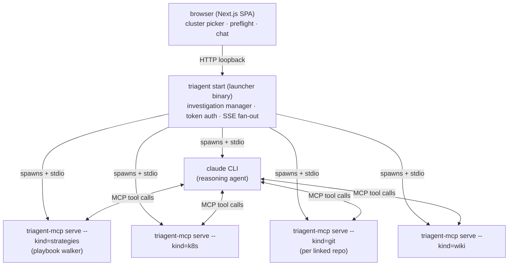

# Investigations

The investigation surface is where operators triage live incidents. Hand the AI the symptom and whatever context you
have (a cluster, a Slack thread, an incident.io link, free-form notes; at least one), watch a structured walker drive
a focused diagnosis, and ship a written conclusion to the team without typing a single `kubectl` invocation.

## What it is

A browser-based investigation companion that pairs:

- **Read-only Kubernetes access** to the cluster the operator is working (pods, events, logs, custom resources),
  exposed through curated tools rather than a raw shell.
- **A guided playbook walker** that knows the failure modes the team has seen before and steers the agent toward the
  relevant evidence instead of letting it freelance.
- **A reasoning agent** (`claude`) that reads notes, calls tools, records findings, and writes the final summary.

The result of a typical session is a tidy markdown summary the operator can paste into Slack or a ticket: symptom,
likely root cause, evidence, recommended next steps. The activity panel keeps every tool call visible, so operators can
audit the chain or interrupt with a follow-up at any point.

For the broader problem this surface addresses — the cross-source scramble a typical incident turns into — see
[Overview → The problem it solves](/docs/overview#the-problem-it-solves).

## How it works

### The agent has no product knowledge of its own

The agent's system prompt is generic. Everything domain-specific (what to look for, what calls to make, what counts
as a finding) lives in playbooks the agent reads at runtime via the strategies MCP. That separation is why a single
launcher can investigate any cluster shape: changing what the system can diagnose is a YAML edit, not a redeploy.

It also means every investigation is a reproducible chain of typed tool calls. The activity panel isn't a
side-effect; it's the canonical artifact, the audit trail an operator hands to a teammate or a regulator. See
[Playbooks](/docs/playbooks#how-the-walker-works) for the per-step walker loop.

### Architecture at a glance

The launcher binds to `127.0.0.1:0` and prints a URL with a per-launch random token. Loading the URL drops a cookie and
the token falls out of the address bar. The launcher stays alive in the terminal for the duration of the session;
`Ctrl-C` tears down all in-flight claude CLIs, port-forwards, and MCP subprocesses.

### One investigation, end-to-end

1. **Provide a starting point.** An investigation needs at least one input: a cluster, an incident URL, a Slack thread,
   or free-form notes. Picking a cluster is optional. When one is picked, the launcher queries the configured provider
   (kubeconfig by default, Teleport when the profile selects it) for the operator's reachable clusters and calls the
   provider's `Login` to obtain a kubeconfig context. With no cluster up front, the agent infers one from the remaining
   inputs and calls `switch_context` at runtime.
2. **Preflight.** When a cluster was picked, confirms it is reachable and RBAC permits read access. Either way it writes
   a per-session `mcp.json` describing which triagent-mcp servers to spawn. The agent narrows down the namespace at
   runtime via the k8s tools; it isn't fixed at preflight.
3. **Spawn the agent.** Claude is launched with that `mcp.json` plus a system prompt that points the agent at the
   `investigation` playbook. The agent is told nothing product-specific in prose; the playbooks carry the procedural
   knowledge.
4. **Walk the playbook.** The agent calls `list_playbooks`, picks a matching domain playbook, and walks it: read step
   description, make suggested calls, call `step_complete` with findings and the matching goto. The activity panel
   renders every tool call live.
5. **Conclude.** The terminal node calls `summarize`, which produces the markdown summary block. The launcher renders it
   inline in the chat as the formal conclusion.
6. **Follow up or close.** The operator can keep chatting (clarifying questions, deeper dives); those route through the
   `followup_conversation` meta-playbook so the response shape stays coherent.

### Separation of concerns

Each part of the system owns exactly one job, so any one can change without touching the others. The launcher itself
contains no decision logic — it wires processes together and streams the result to the browser.

| Concern                | Owner                                                          |
| ---------------------- | -------------------------------------------------------------- |
| Cluster picker / login | Auth provider (kubeconfig by default, Teleport optional)       |
| Tool execution         | triagent-mcp servers (k8s, strategies, git, wiki, ...)         |
| Decision logic         | YAML playbooks (the strategies MCP walks them)                 |
| Reasoning              | Claude CLI (the agent invoking tools)                          |
| UI                     | Next.js SPA (this app), embedded in the launcher binary        |
| Authentication         | Per-launch random token + cookie                               |

Playbooks own the procedure, triagent-mcp owns tool semantics, claude owns judgment. Each piece is editable
independently.

## Using the tool

### Starting an investigation

1. Run `triagent start` from a terminal.
2. The launcher prints a URL like `http://127.0.0.1:46619/?token=…` and opens it in the default browser. The home view
   (`/`) lands on the **shared sessions browser**: investigations the team has pushed upstream (see _Browsing past
   investigations_ below).
3. Click **+ new investigation** in the sidebar (or navigate to `/investigations/new`) to start a fresh one. Pick a
   cluster from the dropdown. If the provider isn't logged in, you'll be prompted to authenticate (SSO/2FA prompts
   surface in the terminal where you ran `triagent start`, not the browser).
4. Fill in the form. The fields below are individually optional, but the investigation needs at least one starting
   point — the cluster you picked above, or one of these:
   - **incident URL** (optional). Pasted verbatim into the agent's prompt as context, useful for incident.io links
     so the agent can pull the corresponding incident metadata if the incident.io MCP is connected.
   - **Slack channel** (optional). When Slack is connected, the field becomes a channel picker (search by name); the
     pinned channel is surfaced to the agent as the suggested default for slack-aware tool calls. If Slack isn't
     connected, paste a channel URL instead.
   - **incident notes** (optional). One sentence of operator framing: *what alert / behaviour brought you here?* The
     agent uses your phrasing to pick the right playbook.
5. Click **run preflight**. The browser switches to the chat view; the activity panel on the right shows tool calls as
   they happen.

### During the investigation

- **Don't interrupt unless you have to.** The walker is faster than manual triage; let it complete a step before
  redirecting.
- **Read the activity panel.** Each tool call is a clickable card: expanding it shows the input args and the result text
  the agent saw.
- **Ask follow-up questions in plain English.** "Can you check the collector logs?" / "What did event X say?" The
  agent threads the follow-up through `followup_conversation` and routes it to the right next move.

### Session toolbar

The session view's chrome carries the operator-action surface. From the header:

- **view latest summary**: appears once the agent has produced at least one `summarize` call. Scrolls the chat to
  the most recent amber-bordered summary block (and flashes it briefly so it's easy to spot).
- **export**: downloads a redacted share bundle (`session.triagent.json`) you can hand to a teammate. They drop it on
  the sidebar to import the transcript on their launcher.

Above the chat textarea (live sessions only):

- **archive**: winds the session down to read-only without deleting the transcript. The original cluster context
  and port-forward are gone, so follow-ups would fail; archiving is what acknowledges that.
- **promote to wiki**: asks the agent to walk `wiki_proposal` and draft an incident write-up from the session's
  findings. Disabled until at least one `summarize` call has landed and the wiki vault is configured. Flips to
  **edit wiki** on subsequent clicks (iterates the existing draft instead of starting over).
- **propose playbook**: asks the agent to walk `playbook_proposal` and draft a YAML playbook if the failure shape
  is novel enough. Same disabled-until-summary gate; flips to **edit playbook** after the first draft.
- **request codefix**: asks the agent to walk `pr_proposal` and, if the investigation revealed a bounded change opportunity, file a GitHub issue + open a draft PR on the affected linked repo(s). Disabled until at least one `summarize` call has landed and `gh` is authenticated. Flips to **edit codefix** after the first draft so subsequent clicks iterate on the open PR (apply review comments, refine scope). See the [Codefix section in the linked-repos page](/docs/repos#codefix) for the full flow.

The diff card the agent posts in response is the review surface for wiki and playbook proposals. Operators don't review proposals in prose; the diff is the conversation. Codefix proposals are reviewed on GitHub directly (the chat-side card is a permalink, not a diff). See the [Playbooks](/docs/playbooks), [Wiki](/docs/wiki), and [Codefix](/docs/repos#codefix) sections for the proposal flows.

### After the conclusion

- **Save and share.** The amber summary block has a copy button; paste into the ticket / Slack / wherever. The
  *view latest summary* header button jumps you to the most recent one if the chat has scrolled past it.
- **Capture what's worth keeping.** Use the action-row buttons above the textarea to trigger a wiki entry, a playbook proposal, or a codefix proposal. The diff card in chat reviews the first two; the third opens a draft PR you review on GitHub.
- **Close the tab when done.** Sessions persist on disk; reopening the URL replays the transcript.

### Resuming and managing sessions

- The sidebar lists every investigation that's ever run on this launcher. Click one to replay. Live sessions show a
  streaming pulse; archived sessions are read-only (the original cluster context is gone, the port-forward is gone,
  follow-ups would fail). A small icon on each row tracks upstream status: a green check when the matching PR is
  open, violet for merged, neutral cloud-up otherwise.
- **Archive** a session from the action row above the chat textarea to mark it done without deleting the transcript.
  **Delete** it from the sidebar (✕ on hover) to remove the on-disk transcript entirely.
- **Import a teammate's bundle.** Drag a `.triagent.json` file onto the sidebar (or use the *↥ import investigation*
  button). The imported session shows an amber **imported from `<context>/<namespace>`** provenance badge in its
  header so it's clear the transcript wasn't produced by your launcher.
- `triagent clean` purges all local sessions in one shot, useful when developing the launcher itself.

### Sharing a session upstream

A finished investigation worth keeping for the team can be pushed into a shared sessions repository. Pushing happens
from an **archived** session. The workflow is *conclude → archive → push*, so the artifact is frozen before it goes
upstream.

1. Conclude the investigation, then archive it via the action-row button.
2. The archived banner exposes a **push to upstream** button. The launcher asks the agent to draft a `session.md`
   (frontmatter + a short write-up) and uploads it together with the raw replay bundle (`session.triagent.json`) under
   `sessions/<YYYY-MM>/<slug>/`.
3. The push opens a PR via `gh`. The archived banner tracks the PR lifecycle (open → merged → closed) as a coloured
   badge, and the upstream `/` home shows the same state on each card. If the PR closes without merging, the **push
   to upstream** button reappears so you can retry.

Once merged, the session shows up in everyone's `/` browser the next time they hit **sync**. Sessions with
closed-but-unmerged PRs are hidden from the upstream view to keep noise down.

### Browsing past investigations

The `/` route is the shared sessions browser, fed by a local clone of the sessions repo. Each card shows the
investigation's title, namespace, and PR badge (when this launcher was the one that pushed it). Clicking a card opens
`/sessions/<slug>`: a read-only render of the upstream `session.md` plus an **open transcript** button that replays the
original chat locally. If you already have a local counterpart it routes you to your existing `/investigations/<id>`;
otherwise it imports the bundle on the fly and opens the imported session.

Sync the browser via the **sync** button in the page header; the launcher does not auto-pull. The header also shows
last-synced time and a "remote ahead by N commits" hint when upstream has new content.

## Auto mode

A second `claude` session, the *operator agent*, drives the chat-side
operator role: answers prompts, picks capture paths, finishes the
session. Bright pink in the UI; the investigation agent stays blue.

### When to use it

Routine, well-known incident patterns where the operator's role is
mechanical. Not appropriate for novel incidents, high-stakes decisions,
or anything where customer context matters. The operator agent doesn't
have it and is trained to yield to you in those cases.

### Enabling

Tick **Run in auto mode** on the start screen before submitting. A watch can also start a session in auto mode
directly (see [Watches](/docs/watches#two-toggles-auto-ingest-and-auto-start)). To hand an already-running manual
session to the operator agent, restart it with auto mode on.

### Take over

While auto mode is running, the chat composer is disabled and the
**Take over** button replaces Send. Press it to pause the operator
agent; you can then type follow-ups as usual.

### Resume auto mode

After a take-over, press **Resume auto mode** to hand control back. The
operator agent receives a catch-up briefing (every transcript envelope
since you took over) and continues from the current state. It will not
re-litigate decisions you made.

### Finishing and restart

The operator agent calls `finish` when the investigation has settled.
The session enters a *finished* phase; the composer re-enables in case
you want to add a manual note. A **Restart auto mode** button is
available if you need to wake the operator back up.

### What the operator agent will not do

- Run cluster tools (it has none, only chat).
- Invent customer context, recent deploys, business impact.
- Make operator-side decisions with operational consequences
  (e.g. recommending a pod restart on production). It yields to you with
  a pink chat note when it should.

### Reading the transcript

- **Blue** envelopes = the investigation agent (same as always).
- **Pink** envelopes = the operator agent (its messages and its
  internal tool calls in the activity panel).
- **Default** envelopes = you.
- **Horizontal pink dividers** mark phase transitions: *auto mode
  started*, *human took over*, *resumed*, *auto mode finished*.
- The activity panel collapses the operator agent's internal work
  into an **Auto-operator** group; expand if you want to see how
  it reasoned through a turn.

## Tips

- **Provide one good sentence in the notes field.** "Operator reports CR `backup-prod-eu` is stuck not Ready" beats
  "backup broken". The agent uses your phrasing to pick the right playbook.
- **Don't paste ten log lines unless they're the smoking gun.** The agent will pull logs itself; you giving it five
  lines from a random pod is more confusing than helpful.
- **Stop the agent if it's clearly off-course.** Type `stop, look at X instead` and it'll redirect. The walker is
  suggestive, not prescriptive.
- **Trust the activity panel for "what did the agent do?"** Don't scroll the chat looking for tool call evidence; the
  activity panel is the canonical record.
