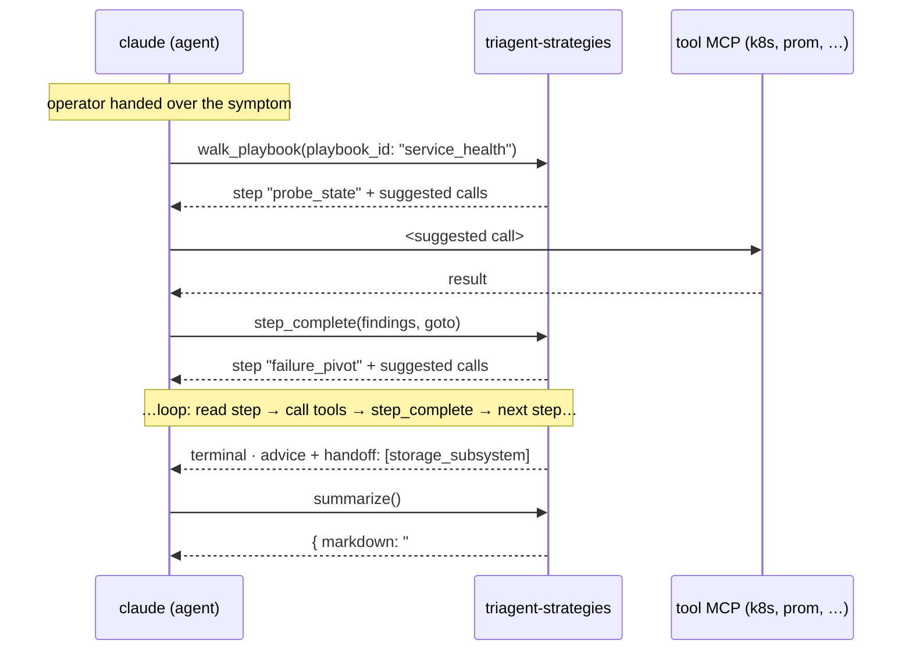
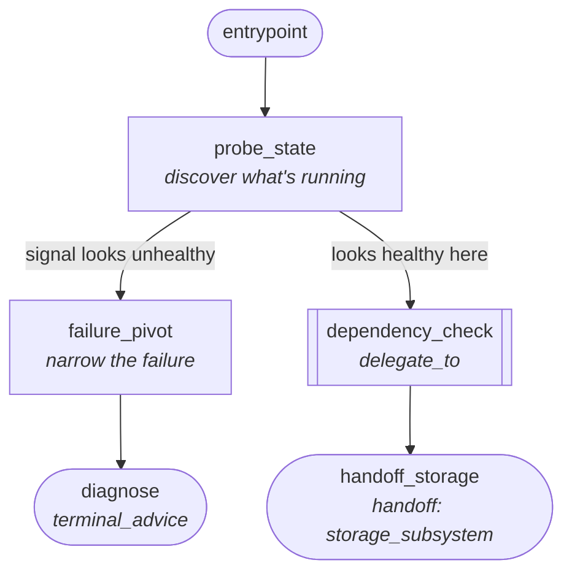
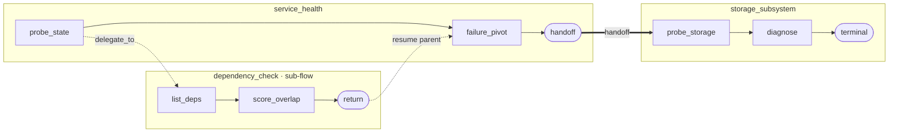
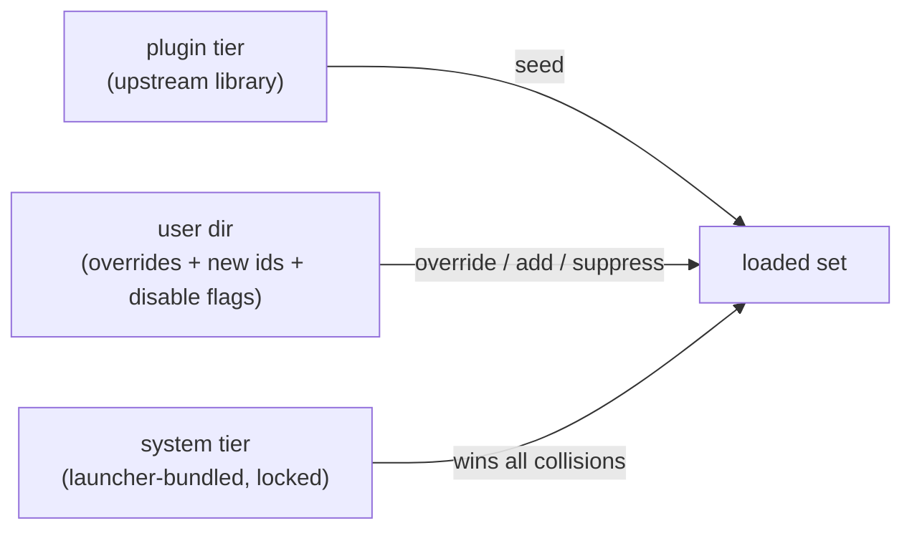

# Playbooks

Playbooks are the procedural knowledge layer of the launcher. Each one is a YAML file that captures a decision tree for
one failure mode: where to look, what to call, what the answer means, and what to do next.

## Why playbooks compound

Adding a playbook is the cheapest way to make the system more capable. Each new YAML file is a new failure shape the
agent can diagnose, with **zero impact on context size**. The agent only loads a playbook when an investigation enters
it. Add 50 playbooks, the agent gets 50× more capable; its working context stays the same size.

Combine that with `handoff` and `delegate_to` and you get behaviour none of the playbook authors explicitly designed:
a connectivity playbook composing with an elasticsearch playbook composing with a code-root-cause playbook, on demand.
The graph is also the documentation: a new operator reading `cluster_health.yaml` learns the triage script by reading
the same YAML the agent walks. One source of truth for "how do we investigate X".

## How the walker works

The strategies MCP doesn't run the playbook; the agent does. The walker tracks state (current step, recorded
findings, branch options) and answers two questions per step: *"what does this step say?"* and *"if I tell you which
branch matched, what's next?"*. The agent reads the description, makes the suggested calls against the other MCPs,
records what it found, and picks a branch label. Loop until terminal.



The agent never picks "what's next" in free-form. It records evidence under a key and chooses one of the walker's
pre-declared branches by *name*. That contract is what makes every investigation a reproducible trace and what "on
rails" means in practice.

## What a playbook is

A YAML file describing a directed graph of investigation steps:

```yaml
id: cluster_health
symptom: "Cluster reports unhealthy / not Ready"
description: |
  Walks the broad-strokes triage for a cluster reporting unhealthy:
  pod state, recent restarts, dependent-service status, gateway errors.
  Hands off to specialised playbooks (storage, connectivity, …) when a
  specific subsystem is implicated.
entrypoint: pod_state

nodes:
  pod_state:
    description: |
      Survey pod state in the namespace. Anything not Running+Ready
      narrows the investigation immediately.
    suggested_calls:
      - tool: triagent-k8s/list_resources
        args: { kind: Pod }
    expected_findings:
      - failing_pods
    next:
      - condition: "any pods not Ready"
        goto: pod_unhealthy_pivot
      - condition: "all pods Ready — check elasticsearch next"
        goto: terminal_handoff_es
  ...
```

Each node carries:

- A **description** the agent reads to know what it's doing.
- **Suggested calls**: concrete MCP tool invocations to run.
- **Expected findings**: the keys the agent records via `step_complete`'s `findings` array so the audit trail captures the evidence.
- **Next branches**: conditions + goto targets for the next step.
- Optional **terminal advice**: prose handed to the operator when the playbook concludes here.
- Optional **handoff**: playbook ids the terminal can chain to, for cross-playbook navigation.
- Optional **delegate_to**: for sub-flow nodes, id of another playbook to walk to its non-handoff terminal, then resume
  the parent's `next` branch. Mutually exclusive with handoff / terminal_advice / suggested_calls; requires `next`.

The same shape rendered as a graph (this is also what the editor's Diagram tab shows):



Solid nodes are regular steps; rounded nodes are terminals; the double-bracketed node delegates into a sub-playbook
and resumes the parent.

### Composing playbooks

`handoff` and `delegate_to` are the two ways playbooks chain together. They have different shapes and different uses.



- **Handoff** (solid arrow) ends the parent and starts a new investigation in the target playbook. Use when the rest
  of the work belongs to a different domain: the parent has done its job and the target should run as a first-class
  investigation.
- **Delegate** (dashed arrow) walks the target to its non-handoff terminal, then resumes the parent with the
  sub-flow's findings visible in the parent's branch conditions. Use for "enrich and continue", e.g., consult the
  wiki before hypothesising, then return to the main triage.

## Why YAML, not prose in a prompt

System-prompt prose drifts. Every change to the agent's procedural knowledge means a triagent-mcp / launcher rebuild.
Playbooks let the procedure live as data:

- **Visible.** Every routing decision is a tool call rendered in the activity panel, so operators can see _why_ the agent
  went where it did.
- **Editable.** Improving a playbook is a YAML edit, not a code change. The graph editor in the **Playbooks** view opens
  any playbook for inline modification.
- **Auditable.** The chain of `walk_playbook` → `step_complete` → `summarize` calls is the canonical
  decision history. Replay shows the same evidence in the same order.
- **Tracked in git.** Each save commits the playbook file in the launcher's user dir, and the editor surfaces the merged
  upstream + local commit history in a dropdown. Roll back by picking a past commit and re-saving.

The agent doesn't "memorise" playbooks at training time; it reads them at runtime through the strategies MCP. That
decoupling is the whole point.

## The three tiers

Every playbook in the launcher comes from one of three tiers, each with different ownership semantics:

### Plugin tier

The upstream `sourcehawk/triagent-playbooks` repo, cloned locally into
`~/.config/triagent/upstream-playbooks/`.

- Contains the **domain library**: cluster_health, elasticsearch, connectivity, crossplane_infra, backup,
  process_execution, stuck_reconciliation, plus alert-driven entry points (`crossplane_failing_reconciliations_alert`,
  `example_operator_continuously_reconciling`, `gateway_5xx_spike`) and narrow shape playbooks
  (`unified_gateway_image_check`, `zeebe_partition_unhealthy`, `control_plane_job_failure`). Code-level orientation is
  in the system tier as `git_inspect` (formerly the `code_root_cause` plugin playbook).
- **Overridable** by user-dir files. The operator can edit a plugin playbook and save; that creates a user version that
  wins on next load.
- Synced via the **Sync** button on the playbooks list. The button also surfaces "remote ahead by N commits" when the
  upstream has new content.
- Pushable: the editor's **push as PR** button commits the active user version into the operator's Triagent checkout
  and opens a GitHub PR via `gh`.

### System tier

Launcher-bundled meta-playbooks that ship with the launcher binary. Materialised on disk under
`~/.config/triagent/system-playbooks/` at every startup from the embedded fileset.

- Contains the **contract**: `investigation` (the master entrypoint that routes to a domain playbook),
  `playbook_proposal`, `followup_conversation`, `wiki_proposal`, `wiki_recall`.
- **Locked**. User-dir files targeting a system id are silently dropped at load time and rejected loudly at save /
  delete / push-PR time.
- Versions with the launcher binary. To change a system meta you edit `investigate/system/<id>.yaml` in the launcher
  source and rebuild.

System tier is locked because these playbooks define the agent's flow itself; letting an operator-side override
silently change the contract is a footgun.

### User tier

The operator's own playbooks, stored under `~/.config/triagent/playbooks/<type>/<id>.yaml`, one file per
id. The user dir is a git repo (the launcher runs `git init` on startup if it isn't one already).

- Contains operator overrides of plugin ids + brand-new playbooks.
- Each save overwrites the file and commits in the user dir. Git is the version axis: the editor's commits dropdown
  reads `git log` of the path. Rollback = pick a past commit and re-save (which creates a new commit pointing back to
  that body, the natural git pattern, no in-place rewrite).
- An **`active: false`** flag on the file suppresses it, the operator's "I don't want this playbook running" switch.
  For a plugin id, this writes a single user-dir file with the upstream body and `active: false`; toggling back to
  `active: true` re-enables it.

User playbooks never override system metas. They override plugin playbooks, or stand alone as fresh ids.

### Resolution

When the strategies MCP loads at session start:



Result: the system contract is immutable, the plugin library is overridable, and the operator's authored content is
editable.

## How playbooks are created

### Manually, in the editor

1. Open the **Playbooks** view, click **+ new playbook**.
2. Pick a type slot (investigation, general, …).
3. Edit the id, symptom, description, and the seed node.
4. Add nodes via the **+ add node** button in the right-side panel (always visible, pinned outside the form scroll).
5. Wire `next` branches between nodes; the graph view updates live.
6. Save when valid. The YAML preview tab shows a green checkmark when structurally valid.

### From an investigation, via the AI

After delivering a conclusion, the agent considers whether the investigation surfaced a reusable failure shape. If so,
it walks the `playbook_proposal` meta-playbook:

1. Tests the bar: is this novel enough?
2. If yes, drafts the YAML against the schema.
3. Validates, iterates if needed.
4. Submits via `playbook_proposal_draft`. The chat panel renders a side-by-side diff card with **approve & activate
   locally** / **decline**.
5. Approve to land it in the user dir as a new commit on `<id>.yaml` (active by default); decline drops the draft. Type
   follow-up notes in the decline box and the agent re-drafts.

The diff is the review surface. Operators don't review proposals in prose; the YAML diff is the conversation.

### Authoring from scratch with the chat agent

The fastest way to draft a brand-new playbook is to open the editor's chat drawer and ask the agent to do the research
and the YAML authoring for you. The drawer (bottom of the playbook editor) opens a session that has access to the same
MCP surface the chat agent uses elsewhere, including the linked-repo triagent-git tools, which the agent will reach for
unprompted when the topic is "investigate \`<some component>\`" and a matching repo is registered.

#### Walkthrough

1. Click **+ new playbook** in the playbooks view, give it a placeholder id, and save once so the editor mounts a
   session.
2. Open the chat drawer (the chat-bubble button in the editor toolbar). The drawer is frozen to _this_ playbook at the
   currently-viewed commit; anything the agent proposes lands as a draft you can approve, which on approval becomes a
   new commit on the file.
3. Ask in plain English. A good first prompt is goal-shaped, not step-shaped:

   > please create a playbook for me to investigate example-operator external monitoring (\`ExternalMonitoring\`)
   > issues.

   The agent will most likely **deep-search the matching repo on its own** before drafting. For the example above, it
   will reach into the \`example-operator\` triagent-git server, walk the reconcile loop source,
   read the condition strings + RBAC requirements, and structure the playbook around the same decision tree the
   controller actually runs. Watch the activity panel; you'll see \`analyze_change\` / \`search_log\` calls fire before
   the YAML draft lands.

4. The first draft arrives as a diff card in the chat. Read the graph in the **AI proposal** tab (it renders the
   proposed playbook as a graph so you can sanity-check the shape) and either:
   - **approve & activate locally**: writes the file as the operator's active version of this id and commits it.
   - **decline**: drops the draft. Type follow-up notes in the decline box ("tighten the RBAC node", "add a branch for
     the forward-auth gate") and the agent re-drafts.
5. Iterate until the proposal looks right, then push as a PR via the editor toolbar to share it with the team.

You don't have to type the whole spec. The agent picks the type slot, the symptom phrasing, the entrypoint, the node
ids, and wires suggested calls from the live tool catalog. Your job is operator intent ("what should this playbook
investigate?") + sanity-check review.

### Editing with chat

The same chat drawer also drives **edits** to an existing playbook. Ask: _"add a branch for ES yellow that hands off to
elasticsearch"_, _"tighten the symptom wording"_, _"split the collector_unhealthy node into two"_. The agent drafts the
change, validates it, and submits a proposal: same diff card flow as authoring from scratch. Drawer closes preserve the
session (re-open to resume); the X button kills it.

## Authoring conventions

- **Broad → narrow.** Early nodes scope the symptom; later nodes drill into a specific subsystem.
- **One terminal per outcome.** A playbook should have at least one terminal node per distinct conclusion ("healthy",
  "ES down", "operator misconfig", …). Don't fold three outcomes into one terminal_advice block.
- **Handoffs over bloat.** When you'd add ≥3 new nodes to a playbook that's already ≥10 nodes, draft a new dedicated
  playbook for the sub-investigation and add `handoff: [<new_id>]` to the parent's terminal. Keeps each playbook
  readable, gives operators a per-piece enable/disable knob, and makes the sub-flow runnable on its own.
- **Sub-flows for "enrich and continue".** When a node should walk another playbook to completion and then resume (e.g.,
  reading external sources before hypothesizing), use `delegate_to: <other_id>` instead of a handoff. Findings recorded
  inside the sub-flow are visible to the parent's post-resume branches; the sub-flow MUST end in a non-handoff terminal
  so the walker knows where to pop back to.
- **Conditions read by the AGENT, not the walker.** The walker doesn't evaluate condition strings; the agent does.
  Write them as prose the agent can match findings against.
- **Use placeholders.** `${cluster_id}` and `${namespace}` get substituted at suggestion time; don't hardcode
  cluster-specific values.

## Validator gates

Every save / proposal runs through `validate_playbook`. The strict checks include:

- Top-level id matches `^[a-zA-Z0-9][a-zA-Z0-9_-]{0,63}$`.
- Every node id matches the same pattern.
- Entrypoint resolves to a real node.
- Every `next[].goto` resolves; no self-loops.
- Every `next[].condition` is non-empty.
- `suggested_calls.tool` is non-empty and in `<server>/<tool>` form.
- At least one terminal node exists.
- Every node is reachable from the entrypoint.
- `handoff` ids match the id pattern.
- `delegate_to` is shape-valid; the node has `next`; no conflict with `terminal_advice`, `handoff`, or
  `suggested_calls`.

Validator failures surface in the YAML preview tab as a red issue count + per-error list. Saving a draft with errors is
blocked until they're fixed.

## Using the playbooks view

- **List view.** Shows every playbook the launcher knows about, filterable by type. Each card carries a source badge
  (remote = plugin, system = locked, local = user/override) and a status pill (active / disabled).
- **Editor.** Open a playbook to edit. Three tabs:
  - **Diagram**: graph view, click nodes to select.
  - **YAML**: the canonical text, with a copy button and a green "valid" pill when structurally clean.
  - **AI proposal**: disabled until the chat agent submits a draft; shows the proposed playbook as a graph + the
    approve/decline surface, with a discard ✕ on the tab corner.
- **Commits.** The dropdown next to the source badge lists recent commits affecting this playbook (merged across the
  upstream clone and the user dir, newest first; "show more" pages older entries). Pick a commit to load its body as a
  draft; the active commit is labelled `latest · …` so re-selecting it is a single gesture. Save to roll back, and the
  chosen body becomes a new commit.
- **Save dialog.** The Save button opens a small dialog with an optional commit message; the input's placeholder
  (`<id>: update`) hints at the auto-message used when you leave it empty. Active-only flips get a flavoured
  auto-message server-side.
- **Push as PR.** Available for plugin / user / override entries with `gh` + a Triagent checkout configured. Strips
  the local `active` flag and any legacy `version:` field on the way out so the upstream commit reads as a clean YAML
  body. Disabled for system metas (those ship with the launcher).

## Where to put new playbooks

| Authoring scenario                   | Goes here                                                                                          |
| ------------------------------------ | -------------------------------------------------------------------------------------------------- |
| New domain failure mode              | New plugin playbook → push as PR upstream                                                          |
| Override an existing plugin playbook | User dir (the editor's save flow)                                                                  |
| Disable a plugin playbook locally    | Toggle the active flag in the editor and save (writes a single user-dir file with `active: false`) |
| Change the agent's flow contract     | Edit `investigate/system/<id>.yaml` + rebuild                                                      |
