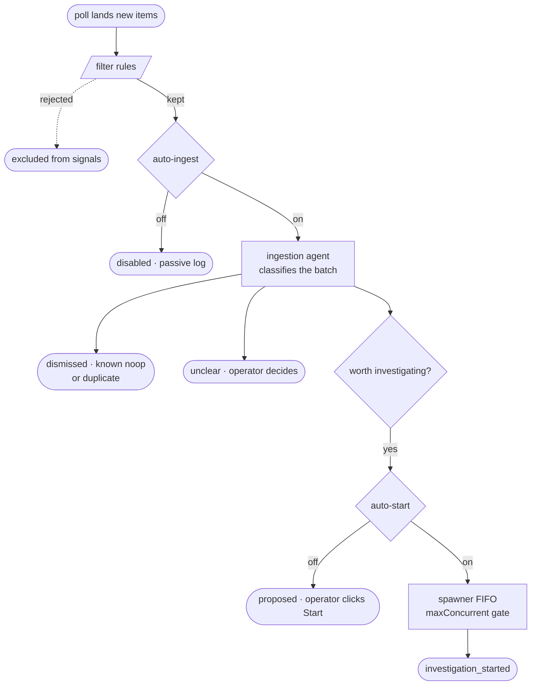

# Watches

Persistent eyes-on a source (a GitHub issues query, a Slack channel) that poll
on a schedule so the launcher hears about new alerts, bug reports, or incident
drafts at most one polling interval after they land. The ingestion agent can
classify each batch into structured signals; with auto-start enabled, those
signals become full investigations without the operator clicking through.

## Pre-triage, not another inbox

The job of a watch isn't to collect items; it's to **decide which ones deserve
your attention** before you look. Slack channels and GitHub issue queues are
already inboxes; piping them into yet another list would just multiply the
noise. What watches add is a classifier in front of the stream: the agent reads
each batch, dismisses what's already documented as known-noop, dismisses what
duplicates an open signal, asks for help on the ambiguous ones, and (when the
bar is clearly met) drafts an investigation briefing.

That shifts the operator's attention from "is anything happening?" to "which
one of these three pre-classified signals do I open first?" The wiki and the
agent's recent-signal history are the memory that makes this work: false
alarms documented once stop paging you, and the same item flagged twice in an
hour gets folded into the open signal rather than spawning a duplicate
investigation. Watch quality compounds the same way the wiki does: a watch on
a noisy channel is most useful once the recurring noops have wiki entries.

## What it is

A watch is a per-source config (kind, query/channel, poll cadence, filters,
two toggles) plus a rolling cache of the items the source has returned and the
signals the launcher emitted from them. Created and edited from the **Watches**
tab in the top nav; the underlying `user_watches.yaml` next to the sessions
data dir round-trips cleanly if you'd rather edit by hand.

Two source kinds today: **GitHub issues** (any query you'd hand to
`gh issue list`, scoped to a repo + labels + state) and **Slack channel**
(every new message in the channel, optionally including thread replies). New
kinds are pluggable behind the same poller/ingestor interface.

## Two toggles: auto-ingest and auto-start

A watch carries two independent on/off switches that shape what happens after
a poll. The combination determines whether the launcher is a passive log, a
pre-triage queue, or a fully autonomous spawner.

**auto-ingest** gates whether the ingestion agent runs at all. Off: items
land as one stub `disabled` signal each, a structured, time-stamped feed of
the source, free. On: each poll that produces new items spawns a short-lived
`claude -p` agent that classifies the batch.

**auto-start** gates whether the agent's investigation-worthy recommendations
actually create investigations. Off: the agent's `start_investigation` calls
land as `proposed` signals; the operator reviews the briefing on the card and
clicks **Start investigation** to launch each one. On: the spawner picks them
straight off a FIFO queue and creates the investigation up to `maxConcurrent`
in flight. Auto-start requires auto-ingest; the form enforces this.

Three useful operating points fall out of the matrix:

- **both off**: passive log. One signal per item, no agent cost. Use when you
  just want a time-stamped feed of a source surfaced in the launcher UI.
- **auto-ingest on, auto-start off**: pre-triaged queue. The agent does the
  reading; you get a short list of `proposed` cards with briefings, plus the
  `unclear` ones that need human judgement. The intended path for high-stakes
  channels where every spawn should be confirmed.
- **both on**: fully autonomous. Routine incident patterns spawn end-to-end
  without you in the loop; you read summaries, not alerts. Combine with auto
  mode (see [Investigations → Auto mode](/docs/investigations#auto-mode)) and
  the operator role drops out too.

## Outcomes

Every signal carries one current outcome, and the card on the watch detail page
groups by it:

- **`disabled`**: auto-ingest off; the launcher recorded the item but didn't
  classify it. The **Start investigation** button on the card is the manual
  escape hatch.
- **`proposed`**: agent recommends investigating; you confirm. The card
  shows the briefing the agent wrote.
- **`queued`**: auto-start on; spawner has the signal but hasn't created the
  investigation yet (waiting on `maxConcurrent`).
- **`investigation_started`**: an investigation exists for this signal. The
  card links straight to the session.
- **`unclear`**: agent saw the items but couldn't classify with confidence.
  Operator decides via **Start investigation**.
- **`dismissed`**: agent classified the items as noise: a known noop (via
  wiki correlation), a duplicate of a recent open signal, or content-free.
- **`failed`**: spawner's investigation create returned an error. Retry from
  the card.

## The ingestion agent

When auto-ingest is on, each productive poll spawns a short-lived agent with
a small MCP tool surface: signal-history lookup, optional wiki correlation,
and three classification tools: `start_investigation(briefing, cited_items,
clusters?)`, `report_unclear(items, reason)`,
`dismiss_items(items, reason, dismissed_related_to?, dismissed_wiki_slugs?)`.

The agent reads recent non-dismissed signals first (so it can fold a recurring
symptom into the open signal rather than draft a duplicate), consults the wiki
when available (so false alarms documented once stay dismissed), and calls one
of the three tools per item or per group of items. The classification is
durable, written by the launcher and not the agent, so a crashed run never
loses work.

The runs panel on the watch detail page surfaces every invocation: amber while
in flight, green or red when the agent returns. Expanding a row shows the
prompt the agent received and its raw output, so the inevitable "agent ran but
produced nothing" case has a one-click answer.

## Recurrence handling

Two mechanisms keep the signal feed from snowballing into noise:

1. **Recent signals.** The agent reads the last ~72h of non-dismissed,
   non-failed signals before classifying. When an item is closely related to
   an open one, the agent dismisses it with a back-reference instead of
   spawning a duplicate.
2. **Wiki correlation.** When a wiki vault is configured, the agent searches
   it for matches against the item's entities or symptom keywords. Entries
   that document a known noop produce a `dismissed` signal citing the matching
   wiki slugs. This is the "false-alarm documented in the wiki stays
   dismissed" feedback loop: write the entry once, stop getting paged about
   it.

## Filters

A filter rule rejects items before the ingestion agent sees them, useful for
trimming bot traffic, ignoring known-quiet labels, or scoping a channel watch
to a specific incident type. Each watch can carry any number of rules; an item
must satisfy every rule to pass. Rejected items still land in the audit log
with a `filtered:` annotation and a **Show filtered** toggle reveals them
greyed out on the Items panel.

Available fields by source. GitHub issues: `title`, `body`, `author`,
`label`. Slack channel: `text`, `author`. Operators: `contains`,
`does_not_contain`, `regex_matches`, `not_regex_matches`.

## Custom instructions

A free-form per-watch addendum that the ingestion agent sees as part of its
system prompt. Use it to nudge classification without changing code:

- *"Treat any item opened by an external contributor as unclear rather than
  dismissed."* This raises the bar for noise suppression on community-facing
  repos.
- *"Ignore items mentioning customer X."* A short-term escape hatch while a
  noisy customer onboards.
- *"A 'severity: low' label means informational only; dismiss unless the body
  explicitly describes an outage."* This encodes triage policy the agent
  otherwise wouldn't know.

The text appears verbatim in the run log's user-prompt section, so confirm it
landed by expanding a run row after the next poll.

## Manual start, pause, delete

Every signal, including `disabled`, `dismissed`, `unclear`, and `failed`,
exposes a **Start investigation** button on its card. Clicking opens a modal
where the operator edits the agent's suggested cluster hints before
submitting. Manual starts carry a back-reference to the source watch + signal,
prefix the investigation title with `[watch: <name>]`, and show a `← from
watch / signal` chip in the SessionView header that links back.

The **Pause** toggle on the list row and the detail header stops polling
without deleting anything; resume picks up where the watermark left off. The
**Delete** button on the detail page removes the watch entirely (config +
on-disk data) behind a type-to-confirm prompt. The **↻ Poll now** button
forces a one-shot poll, useful for sanity-checking a new source config or a
filter rule.

## Tips

- **Start passive.** Both toggles off, watch the feed for a day or two. You'll
  see what the source actually produces before the agent gets a vote.
- **Flip auto-ingest on second, auto-start third.** The proposed-only mode is
  where you build trust that the agent's briefings are useful; flip auto-start
  once you stop disagreeing with its calls.
- **Write wiki entries for dismissals you'd repeat.** Every recurring "this is
  a known noop" you dismiss by hand is a wiki entry the agent could have
  dismissed for you. Documenting it once pays for itself by the third
  recurrence.
- **Custom instructions decay.** Tighten them when you re-read the runs panel
  and see the agent miscalling the same thing repeatedly; loosen them when
  the channel's behaviour changes.
