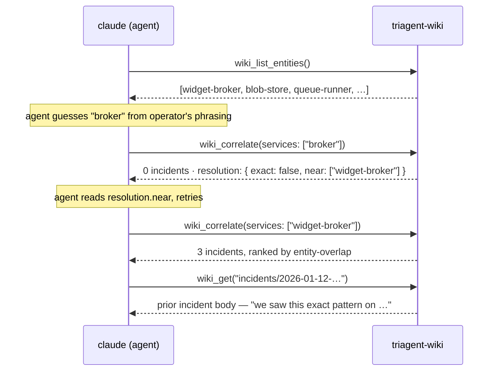
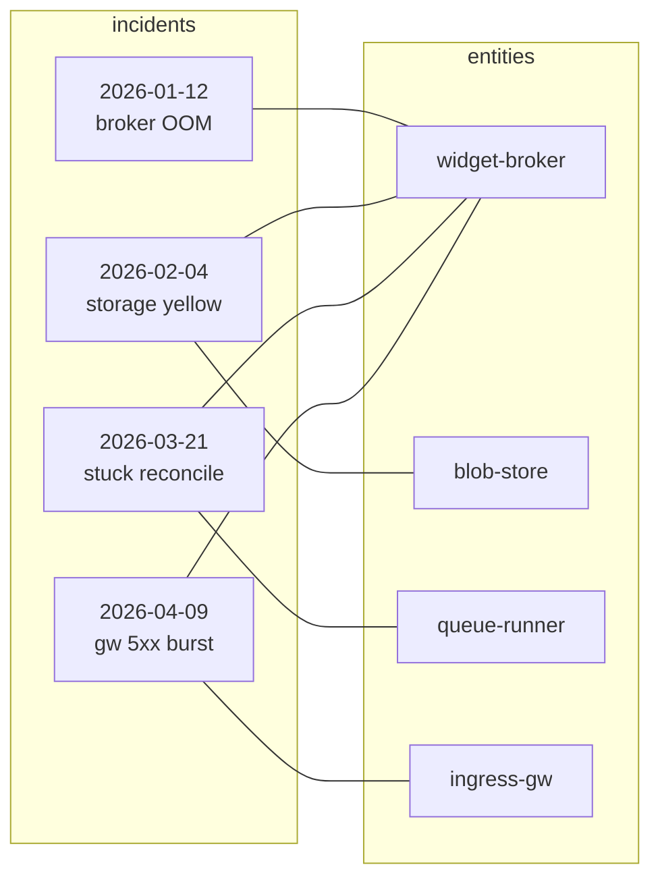
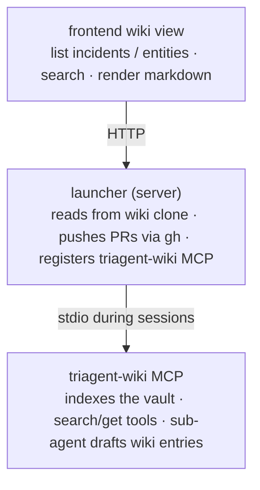

# Wiki

The wiki is the launcher's persistent knowledge surface: incident write-ups and entity profiles that survive across
investigations, get indexed for search, and feed back into future triage.

## Citation infrastructure, not a notes app

The wiki's job isn't to store paragraphs; it's to make "have we seen this before?" answerable in one tool call. Every
incident that touches `widget-broker` indexes under that exact canonical string, so a future investigation looking at
the same component pulls every prior incident in one `wiki_correlate` call. The agent says "we saw this exact pattern
on 2026-01-12" with a real link, not a hallucinated memory.

That guarantee is purchased with discipline. Canonical entity names (`^[a-z0-9][a-z0-9-]*$`) are exact-match: no
fuzzy lookup, no "did you sort of mean broker?" The constraint is the feature: it's what stops the same entity from
indexing under five different ad-hoc names and lets cross-references survive.

**Link density compounds recall quality.** Each new entry that links existing entities makes the next investigation's
correlate-call return better hits. A sparse vault recalls poorly; a dense one becomes the team's shared memory. The
single highest-impact thing you can do when drafting an entry is link every entity it touched.

## What it is

A markdown vault, structured into two kinds of file:

- **Incidents**: one file per past investigation worth remembering. Symptom, root cause, evidence trail, resolution,
  links back to the playbook(s) used.
- **Entities**: one file per long-lived component (a CRD, a controller, a workload, a tenant). Accumulates context:
  what it is, how it fails, who owns it, related incidents.

The vault is a real git repo (`sourcehawk/triagent-wiki` by default, configurable). The launcher manages a clone,
the triagent-wiki MCP indexes it for the agent, and approved entries are pushed back upstream as PRs.

## Why a wiki, not just better playbooks

Playbooks capture the _procedure_ for diagnosing a known failure shape. The wiki captures the _facts_ that surfaced
during diagnosis:

- "We saw this exact stuck-reconciliation pattern on 2025-12-03; the cause was a stale Crossplane provider pod."
- "The `BackupSchedule` CR's `status.conditions[].reason=Storing` means S3 write latency is high; check the bucket's
  IAM."
- "Cluster `prod-eu-23` runs an older Operate version with a known metrics-endpoint bug; see incident 2025-11-12."

Procedure belongs in playbooks (where it's structured + walkable). Facts belong in the wiki (where they're searchable +
cross-linked). Both feed the agent at investigation time:

- Playbooks tell the agent _what to do_.
- The wiki tells the agent _what we already know_.

## How entries get created

### From a finished investigation, via the agent

After concluding an investigation worth capturing, the agent walks the `wiki_proposal` meta-playbook:

1. Drafts an incident write-up from the session's findings + summary.
2. Identifies entities the incident involves (CR names, workload labels, controller versions) and drafts stub entries
   for any that don't already exist.
3. Submits via the triagent-wiki MCP's draft tool. The chat panel renders a markdown diff with **Approve** / **Decline**.
4. Approve to push the entry as a PR against the wiki repo via `gh`.

Same review pattern as playbook proposals: the diff is the conversation.

### Manually

The wiki view (top nav → **wiki**) lets operators browse, search, and (for the launcher author tier) directly edit
entries. The path is rarer than the agent-driven flow but supported: edits land in the local clone and push as PRs the
same way.

## Indexing and search

The triagent-wiki MCP indexes the vault at startup, then exposes:

- `wiki_list_entities`: enumerate entity stubs (services, errors, symptoms, components). Always call this _first_; the
  canonical names it returns are what the search tools key on.
- `wiki_search`: keyword + frontmatter search across incident files. Hits are ranked by score (title weighted higher)
  then recency.
- `wiki_correlate`: given a candidate entity set, return the top past incidents ranked by entity-overlap. The strongest
  opening move when an investigation starts; one call surfaces "have we seen this before, and what fixed it".
- `wiki_get`: point lookup by vault-relative path. Returns parsed frontmatter for incident notes; computes backlinks
  for entity notes (which incidents reference this entity).

The agent reaches for these implicitly during investigation: the master `investigation` playbook recommends
`wiki_correlate` early, and a dedicated `wiki_search` meta-playbook codifies the consistent search strategy (see below).

### Search constraints: read this if your search "found nothing"

Both `wiki_search` filters and `wiki_correlate` inputs are **exact-match** on entity names. The vault stores canonical
names matching `^[a-z0-9][a-z0-9-]*$`: lowercase, hyphens only, no spaces / underscores / capitals.

That means:

- `services: ["zeebe-broker"]` ✅ matches the entity
- `services: ["Zeebe Broker"]` ❌ malformed, returns a structured error with a hint
- `services: ["zeebe_broker"]` ❌ malformed, error
- `services: ["broker"]` ⚠️ valid shape but no exact match: query runs, finds zero hits, but the response's
  `resolution` field surfaces close canonical names (`zeebe-broker`) so the caller can retry

**Why exact-match.** Canonical-name discipline is what makes the wiki cross-correlate. If the agent searches with
whatever phrasing it picks up from the operator ("the Zeebe broker", "broker pod", "zeebe pod"), every incident gets
indexed under a different ad-hoc name and cross-references stop working. We trade fuzzy ergonomics for citation
reliability.

**Why structured errors instead of empty results.** A silent zero result is indistinguishable from "the wiki has nothing
on this", and the agent reads it that way and moves on. A loud error ("`'Zeebe Broker'` is not a valid entity name; did
you mean `zeebe-broker`?") tells the agent to retry. Empty results are preserved for genuine misses; malformed queries
are rejected.

**The `resolution` field.** Every `wiki_search` and `wiki_correlate` response carries a `resolution` array (one entry
per (field, input) pair) with `{exact: bool, near: [...]}`. When `exact` is false and `near` is non-empty, the agent
should consider re-running with one of the near-canonical names rather than concluding the wiki has nothing relevant.

The miss-and-retry path in practice:



The structured `near` field is what makes near-misses actionable. A silent zero-result reads to the agent as "nothing
here" and it moves on; "did you mean `widget-broker`?" tells it to retry.

### The wiki_recall meta-playbook

There's a `wiki_recall` playbook (type=`general`) that walks the agent through a consistent recall strategy during
investigation:

1. Enumerate canonical entity names (`wiki_list_entities`).
2. Map raw observations onto canonical names; never pass raw keywords as filters.
3. Call `wiki_correlate` with the canonical set.
4. Read the `resolution` field; if any input wasn't an exact match, adopt a near-suggestion and retry once.
5. Fall back to free-text `wiki_search` for keywords that don't map to any entity.

The agent invokes it via `walk_playbook` with `playbook_id: "wiki_recall"` and the current session's
`parent_session_id`. Use it whenever you want the wiki consulted during a live investigation. It's the difference
between the agent finding a relevant prior incident and confidently declaring "no prior incidents" because its first
guess at an entity name silently missed.

Note: `wiki_recall` is the _investigation-time_ recall strategy (correlate-led). The proposal-drafting flow
(`wiki_proposal`) uses the `wiki_search` tool directly to find similar prior entries to model the new draft after:
different audience, different opener.

## The vault as a citation graph

What `wiki_correlate` actually walks: a bipartite graph of entities and incidents.



`wiki_correlate(services: ["widget-broker"])` returns I1+I2+I3+I4 ranked by edge overlap. Sparse graphs return weak
hits; dense graphs return strong ones. Every new incident that touches an existing entity *thickens* the recall signal
on that entity for every future investigation.

## Vault layout

```
sourcehawk/triagent-wiki/
├── incidents/
│   └── 2026-05-06-stuck-reconciliation-prod-eu.md
├── entities/
│   ├── crds/
│   │   └── ZeebeCluster.md
│   ├── controllers/
│   │   └── example-operator.md
│   └── workloads/
│       └── elasticsearch.md
└── README.md
```

Files are markdown with a short YAML frontmatter (id, type, related ids, last-updated). The launcher's wiki-proposal
tooling enforces the layout; the markdown body is free-form.

## Architecture



The launcher manages the clone (`~/.config/triagent/wiki/` by default), runs `git fetch + reset` on the
**Sync** button, and spawns the triagent-wiki MCP per investigation session.

## Using the wiki view

### Browsing

- The **wiki** tab in the top nav opens the wiki view.
- The left sidebar is the **entity browser**, grouped by type (CRDs, controllers, workloads, …).
- The main pane shows the **incident list** (newest first) plus a search bar above it.
- Clicking an incident opens its rendered markdown in the editor; clicking an entity opens its profile, including a
  computed **referenced in N incidents** backlinks list; those are the live cross-references between entries.

### Searching

The search bar in the wiki home pane searches incident titles and bodies. Results are ranked by relevance, then
recency. Use the entity browser in the sidebar to filter by component instead of free-text.

### Promoting a new entry

When you've concluded an investigation worth capturing:

1. The chat agent will offer to draft a wiki entry; accept the prompt.
2. The agent walks `wiki_proposal`, drafting the incident file + any missing entity stubs.
3. The diff card in the chat panel renders the markdown side-by-side.
4. **Approve** pushes the entry as a PR against the wiki repo (requires `gh` configured). **Decline** drops the draft.

## Tips

- **Don't promote noise.** A one-off tenant misconfig isn't a wiki entry; the agent's `wiki_proposal` playbook walks a
  "novelty bar" before drafting.
- **Entity entries are short.** Two paragraphs of "what is this", a bullet list of failure modes, and cross-links to
  incidents. Don't try to write a textbook.
- **Cross-link aggressively.** The agent's search-and-recall is only as good as the vault's link density. When drafting
  an entity, link every incident that touched it.
- **Treat it like docs, not a runbook.** Runbooks belong in playbooks (procedural). The wiki captures _what we know_:
  durable facts, not action items.
