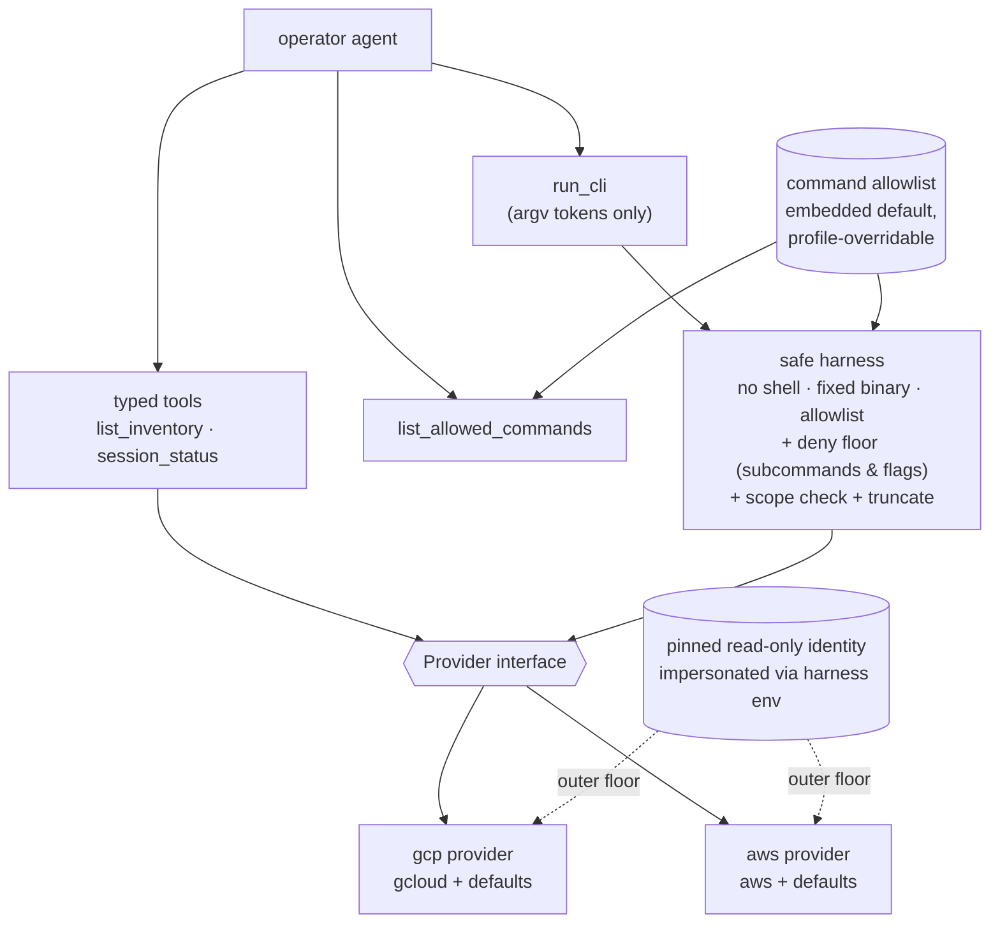

# Read-only cloud-context MCP (GCP and AWS)

## Problem

When triaging a Kubernetes incident, the operator agent can inspect the cluster (`triagent-k8s`) and reach it through Teleport (`triagent-teleport`), but it is blind to the cloud layer the cluster sits on. A large class of incidents is only explicable from cloud context: a Pod cannot reach a dependency because of a firewall rule or security group or a missing route; a workload is denied because an identity lost a binding or a bucket policy changed; the managed cluster (GKE / EKS) behaves unexpectedly because of how its networking or workload identity is configured; the smoking gun is in cloud logs; and "what changed right before this broke?" lives in the cloud audit trail, not in the cluster.

Today answering any of these means a human drops into a cloud console, breaking the investigation loop. The two clouds the platform runs on, GCP and AWS, ask the same handful of questions through entirely different APIs, so the naive fix — one bespoke MCP per cloud, with a hand-written typed tool per resource — is a treadmill: the space of things a responder eventually wants to read is effectively the whole cloud API.

This spec defines a single read-only cloud-context MCP that gives the agent that context without ever being able to mutate cloud state or escalate its own privilege.

## Goals

- Let the operator agent answer cloud-context questions (reachability, permissions, cluster setup, logs, audit trail, inventory) for GCP and AWS from inside an investigation, without a human leaving the loop.
- Make adding coverage a config edit, not new Go; make adding a cloud a new provider behind one interface, not a parallel MCP.
- Guarantee read-only by construction and by harness, with a safety boundary the agent provably cannot bypass.
- Pin the cloud identity to a deployment-chosen, read-only principal that the agent can neither select nor escalate.
- Surface cloud auth readiness before a session starts, so the operator fixes a stale credential proactively rather than discovering a degraded session.

## Non-goals

- Any write, create, update, or delete operation against either cloud. Read-only is absolute.
- Clouds beyond GCP and AWS. The provider interface should not foreclose a third, but none ships here.
- Reading secrets, downloading bucket objects, shelling into instances, or impersonating identities of the agent's choosing. These sit on a hardcoded deny floor regardless of config.
- OAuth / SSO browser login flows inside triagent. Base authentication is the operator's own (or the workload's); triagent never runs an interactive login. This is a candidate future enhancement, not v1.
- Billing, cost, or quota reporting.

## Design overview

One package, `pkg/mcp/cloud/`, exposing `New(Options)` + `Run(ctx)` + a sibling `specs.go::ToolSpecs()`, registered with one `case "cloud"` in `cmd/triagent-mcp/serve.go` (ADR-0001) and selected at launch by `--provider=gcp|aws`. This mirrors the git MCP, which is one package bound per-repo via `--repo` and aliased `triagent-git-<alias>` at the `mcpconfig.go` wiring layer (`internal/preflight/mcpconfig.go`, ADR-0003); here the bound target is a cloud provider, aliased `triagent-cloud-<alias>`. Deployment config (provider, pinned identity, scope allowlist, command-allowlist override path) loads from the runtime profile (ADR-0008).

The tool surface is provider-agnostic and lives once in `specs.go`. It is deliberately thin: two typed tools where shaped output clearly pays its context cost, plus a gated CLI escape hatch for the long tail.

- `list_inventory` — projects / accounts and the accessible resources within an allowlisted scope, so the agent can orient.
- `session_status` — the read-only whoami: which pinned identity is active and whether it is valid.
- `run_cli` — a gated, read-only `gcloud` / `aws` invocation for everything else, with argument tokens supplied as an array.
- `list_allowed_commands` — the discovery tool that reads the same gating config `run_cli` enforces, so what is advertised is exactly what is permitted.

Each typed tool calls through a `Provider` interface; selecting `--provider` chooses the concrete `gcp` or `aws` implementation, plugged in behind the interface exactly like the git MCP's `ghRunner` real-vs-stub seam. Providers return curated projections rather than raw API JSON, following the `pkg/mcp/k8s` `redact.go` discipline.

## Security model

The security model is the heart of this feature. It has two independent layers: the agent cannot run a forbidden command, and the agent cannot act as a forbidden identity.

### The command harness cannot be bypassed

`run_cli` never touches a shell. The guarantee is structural, not a matter of sanitizing strings.

- **Argv-only input.** The tool input is a typed array of argument tokens, never a single command string. The harness never tokenizes a string itself, so there is no in-house splitter to fool.
- **Direct `execve`, no shell.** The harness execs the provider's fixed binary with the argv array (`exec.CommandContext`). No `sh -c` exists anywhere in the package. Shell metacharacters (`|`, `;`, `&&`, `$(…)`, backticks, `>`, newlines) have meaning only to a shell; handed to `gcloud`/`aws` as literal argv tokens they are inert and rejected by the binary. A unit test asserts no `sh -c` / `bash -c` construction exists and that an argv full of metacharacters never spawns a second process.
- **Positive allowlist on the normalized subcommand path** (for example `compute firewall-rules list`, `projects list`), loaded from an embedded default JSON overridable via a profile-pointed path. This is the `LoadAllowlist` pattern from `pkg/mcp/k8s/allowlist.go`: embedded default, optional override, applied identically.
- **A hardcoded deny floor the config can never re-enable**, mirroring how `LoadAllowlist` always filters `Secret` regardless of the kinds config. The floor covers dangerous subcommands (`secrets ... access`, `ssh`/`scp`, `cp`/`sync`, `auth`, `config set`) and dangerous flags (`--impersonate-service-account`, `--account`, `--profile`, `--endpoint-url`, `--cli-input-*`, `--configuration`), plus argument values beginning with `file://`, `fileb://`, `@`, `http://`, or `https://` (local-file read and SSRF vectors).
- **Scope validation.** Any `--project` and region/zone (`--region` / `--zone`) in the argv must be in the profile's scope allowlist, so the agent cannot pivot to an un-allowlisted target. Account selection is not scope-validated on argv: `--account` and `--profile` are deny-floored, and account reach is constrained by the pinned identity (`ScopeAllowlist.Accounts` is informational — the AWS account an agent can touch is bounded by the assume-role profile's `role_arn`, not by an argv flag).
- **Output truncation** keeps a raw response from blowing the context budget.
- **Pinned binary and minimal env.** The binary is resolved to an absolute path once at startup; the subprocess runs with an explicit minimal `cmd.Env` (so a poisoned `PATH` cannot substitute a different binary) and closed stdin (no interactive prompt or fed input).

### The agent cannot select or escalate identity

The cloud identity is a deployment-chosen, read-only principal pinned in the profile. The agent can read which identity is active (`session_status`, `list_allowed_commands`) but has no tool to choose, change, or authenticate one.

The identity is a stable contract; how the harness acquires credentials for it is a swappable realization, set by the deployment and injected through `cmd.Env` (which the agent never controls — it supplies argv only):

- **Operator-ambient base auth plus harness-pinned impersonation (v1 primary).** The operator is authenticated as themselves through their own normal tooling (`gcloud auth login`, `aws sso login`). The harness pins impersonation of the configured read-only identity via environment: `CLOUDSDK_AUTH_IMPERSONATE_SERVICE_ACCOUNT=<pinned-sa>` for GCP; `AWS_PROFILE=<pinned>` (a profile whose `role_arn` is the read-only role with the operator's base as `source_profile`) for AWS. triagent stores no credential. Because the pin is in env, not argv, `--impersonate-service-account` and `--profile` stay on the agent deny floor without contradiction. Re-authentication is the operator's own corporate flow, outside triagent.
- **Workload Identity / IRSA (server / headless).** The workload is the pinned identity; base credentials come from the metadata server. This falls out of the same env-injection code path with the base credential sourced from the environment instead of the operator. triagent stores no credential.
- **Static read-only key connection (deferred fallback).** A service-account key (GCP) or static access keys (AWS) pasted into the connections panel, for environments where assume-role is not granted. This is the only realization where triagent holds a secret; it is out of v1 scope and slots in later behind the same connection surface and env injection.

The deployment's read-only IAM grant on the pinned identity is the outermost floor: even a misconfigured-too-broad command allowlist cannot read secrets or exfiltrate, because the identity itself lacks the permission.

## Auth readiness, preflight, and visible degrade

A single whoami probe validates the identity chain: base credentials valid, impersonation / assume-role succeeds, and the resolved identity matches the pinned one. That one probe serves three surfaces so they can never disagree:

- **The connections panel (pre-session visibility).** Cloud appears in the same sidebar panel as Slack and incident.io, but read-only: it is configured in the profile, not entered there. `GET /api/connections` grows a `cloud` array of `{provider, assumed_identity, valid, hint}`. The assumed identity always shows; the validity checkmark and the `ReauthAdvisor` hint (`run: gcloud auth login`) come from the probe, run on panel load so the operator fixes a stale credential before starting.
- **Session preflight (the gate).** `preflight.Run()` re-runs the same probe through the existing `auth.Provider` seam. This extends the current authentication preflight rather than adding new machinery.
- **Visible degrade, not block.** Unlike the current k8s auth preflight, a failed cloud probe does not fail the session. The session starts with the cloud source disabled and visibly marked unavailable; Kubernetes triage proceeds without the cloud axis. A stale cloud credential must never block all investigation. This introduces a soft-degrade path the preflight does not have today.

## Risks and mitigations

- **The agent bypasses the command safety net** (shell metacharacters, flag escapes, identity/endpoint redirection, scope pivot). Mitigated by structural defenses, not string filtering: no shell ever (argv + direct `execve`); a deny floor covering subcommands, flags, and argument prefixes; scope validation. The read-only IAM grant is an independent backstop.
- **Advertised commands drift from enforced commands.** `list_allowed_commands` and `run_cli` read one config; the allowlist is the single source of truth.
- **The agent widens its own allowlist or picks its identity.** The config and the pinned identity load server-side from the profile; the agent has tools to read them, none to mutate them. Impersonation is pinned in harness-controlled env, never agent argv.
- **Raw CLI output blows the context budget.** Output truncation on the escape hatch, plus typed tools for the orientation path.
- **Operator-ambient impersonation needs an IAM grant** (assume-role / `serviceAccountTokenCreator` on the pinned role). This is a one-time admin setup and the price of not storing a secret; documented as a deployment prerequisite. Workload Identity is the no-grant alternative for server deployments.
- **Soft-degrade is new preflight behavior.** The degrade path is cloud-source-scoped and explicit; the existing k8s block-on-failure behavior is unchanged.

## Alternatives considered

- **One bespoke MCP per cloud (`triagent-gcp`, `triagent-aws`).** Rejected: copy-pasted tool plumbing across two packages, against the "prefer a shared helper to a second consumer" and "don't introduce a new top-level MCP for a bound target" conventions. The provider abstraction collapses both into one package bound by `--provider`, the git-MCP pattern.
- **A fat typed-tool surface, one per resource.** Rejected as a treadmill: the readable surface is effectively the whole cloud API. The thin-typed-plus-gated-CLI split covers the long tail through config instead of code, and any axis can be promoted to a typed tool later when its raw output proves too noisy.
- **CLI-only, no typed tools.** Rejected: orientation (`list_inventory`) and the auth whoami (`session_status`) earn shaped output, and raw `--format=json` dumps are exactly the context cost `redact.go` exists to avoid.
- **Read-only enforced solely by IAM, free-form CLI on top.** Rejected as the whole story: read-only IAM still reads secrets and exfiltrates bucket objects, so "read-only" is necessary but not sufficient. The harness deny floor is what excludes those; IAM is the backstop, not the fence.
- **triagent holds a stored cloud credential as the primary model** (static key connection). Rejected as v1 primary: it puts a long-lived secret in triagent's custody and forces in-app re-auth. Operator-ambient impersonation stores nothing, gives a better audit trail (human plus role), and pushes re-auth to the operator's existing tooling. The stored-key connection survives as a deferred fallback for environments without assume-role.
- **OAuth / SSO login inside triagent.** Deferred: a different tier of work (callback handling, refresh-token storage and rotation, per-provider divergence, expiry visibility) for marginal gain over piggybacking on the operator's own session. Slots in later as one more env source behind the same connection.
- **Block the session on cloud auth failure** (mirroring k8s preflight). Rejected: cloud is secondary context; a stale cloud credential must not make a Kubernetes incident un-investigable. Visible degrade keeps triage moving.

## Vocabulary

- The server is the **cloud-context MCP**; instances are aliased **`triagent-cloud-<alias>`**.
- The swappable backend is a **provider** (`gcp`, `aws`) behind the **`Provider` interface**.
- The gated escape hatch is **`run_cli`**; its catalog is **`list_allowed_commands`**.
- The deployment-chosen identity is the **pinned identity**; the ways the harness acquires credentials for it are **realizations** (operator-ambient impersonation, Workload Identity, static-key connection).
- The investigative groupings (inventory, reachability, permissions, cluster, logs, audit) are **axes** — a navigational vocabulary for organizing coverage, never a code identifier.
